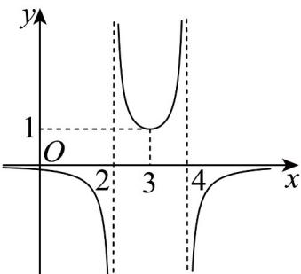

<!-- question-source:start -->
29. 若函数 $f(x) = \frac{1}{ax^2 + bx + c}$ 的部分图象如图所示，则 $f(5) = (\quad)$

A. $-\frac{2}{3}$ B. $-\frac{1}{12}$ C. $-\frac{1}{6}$ D. $-\frac{1}{3}$
<!-- question-source:end -->

![[高中/课堂同步/题库/人教A版高中数学同步讲义(2026)/01_必修第一册/期中/期中复习（易错点12+易错题64+考点32）（高效培优期中专项训练）数学人教A版高一必修第一册/十五_函数的图象与图象的变换/questions/answers/Q00078917A1.md]]
