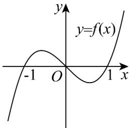
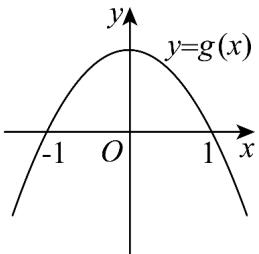

> [!faq]- 《期中复习（易错点12+易错题64+考点32）（高效培优期中专项训练）数学人教A版高一必修第一册》官方解析
>
> > [!success]- **【答案】**   A. $(- \infty, -1) \cup (-1, 0)$ B. $(- \infty, -1) \cup (0, 1)$ C. $(-1,0)\cup (1, + \infty)$ D. $(0,1)\cup (1, + \infty)$
>
> > [!note]- **【分析】**
> > 分析 $f(x)$ 与 $g(x)$ 的取值情况，不等式 $f(x) \cdot g(x) < 0$ 等价于 $\left\{\begin{aligned}f(x) &< 0 \\ g(x) &> 0\end{aligned}\right.$ 或 $\left\{\begin{aligned}f(x) &> 0 \\ g(x) &< 0\end{aligned}\right.$ ，解得即可.
>
> > [!note]- **【解析】**
> > 由 $f(x)$ 的图象可知当 $x \in (-1,0) \cup (1, +\infty)$ 时 $f(x) > 0$ ，当 $x \in (-\infty, -1) \cup (0,1)$ 时 $f(x) < 0$
> >
> > 当 $g(x)$ 的图象可知当 $x \in (-\infty, -1) \cup (1, +\infty)$ 时 $g(x) < 0$ ，当 $x \in (-1, 1)$ 时 $g(x) > 0$
> >
> > 不等式 $f(x)\cdot g(x) <   0$ 等价于 $\left\{ \begin{array}{ll}f(x) <   0 & f(x) > 0\\ g(x) > 0\end{array} \right.$ 或 $\left\{ \begin{array}{ll}g(x) <   0 \end{array} \right.$
> >
> > 解得 0 < x < 1 或 x > 1
> >
> > 所以不等式 $f(x) \cdot g(x) < 0$ 的解集为 $(0,1) \cup (1,+\infty)$ .
> >
> > 故选：D
> >
> > ## 十六．分段函数的解析式求法及其图象的作法（共2小题）
