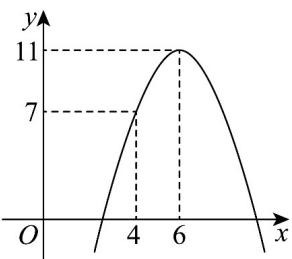

<!-- question-source:start -->
18. (17 分)

为了满足运输市场个性化线路的需求，海南儋州汽车运输公司购买了一批电动汽车投入运营。根据运营情

况分析，每辆电动汽车营运的总利润 $^{y}$ （单位：10万元）与营运年数 $x(x\in\mathbb{N}^{*})$ 为二次函数的关系（如

图），其中 $(6,11)$ 为二次函数的顶点坐标.

(1)在运营过程中，求每辆电动汽车的总利润 $y$ 关于营运年数 $x\left(x \in \mathbf{N}^{*}\right)$ 的函数关系；

(2)当每辆电动汽车营运年数为多少时，儋州汽车运输公司营运的年平均利润最大？年平均利润最大是多少？
<!-- question-source:end -->

![[高中/课堂同步/题库/人教A版高中数学同步讲义(2026)/01_必修第一册/期中/阶段测试/高一数学上学期期中模拟卷_人教A版2019_高效培优_提升卷_/三_填空题_sec_04/questions/answers/Q00066660A1.md]]
