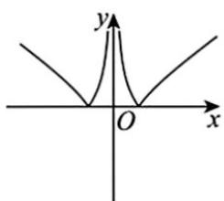
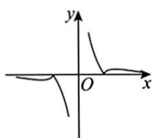
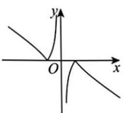
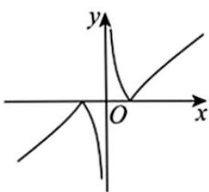

> [!faq]- 《高一数学上学期期中模拟卷（人教A版2019必修第一册第一章1.1~第三章3.4，高效培优·提升卷）》官方解析
>
> > [!success]- **【答案】** A
>
> > [!note]- **【解析】**
> > 当 $k = 0$ 时，不等式 $kx^{2} - 6kx + k + 8$ 0化为80恒成立，
> >
> > 当 $k < 0$ 时，不等式 $kx^{2} - 6kx + k + 8 \quad 0$ 不能恒成立，
> >
> > 当 $k > 0$ 时，要使不等式 $kx^{2} - 6kx + k + 8 = 0$ 恒成立，需 $\Delta = 36k^2 -4(k^2 +8k)\leq 0$
> >
> > 解得 $0 < k \leq 1$
> >
> > 综上所述，不等式 $kx^{2} - 6kx + k + 8$ 0对任意 $x\in \mathbf{R}$ 恒成立， $k$ 的取值范围是 $0\leq k\leq 1$
> >
> > 故选：A.
> >
> > 5. 不等式 $\left(\frac{1}{2} - x\right)\left(\frac{1}{3} - x\right) > 0$ 的解集是（）A. $\left\{x\mid \frac{1}{3} < x < \frac{1}{2}\right\}$ B. $\left\{x\mid x > \frac{1}{2}\right\}$ C. $\left\{x\mid x <   \frac{1}{3}\right\}$ D. $\left\{x\mid x <   \frac{1}{3}\right.$ 或 $x > \frac{1}{2}\Bigg\}$
> >
> > 【答案】D
> >
> > 【详解】由 $\left(\frac{1}{2} - x\right)\left(\frac{1}{3} - x\right) > 0$ ，得到 $\left(x - \frac{1}{2}\right)\left(x - \frac{1}{3}\right) > 0$ ，解得 $x <   \frac{1}{3} x > \frac{1}{2}$
> >
> > 所以不等式 $\left(\frac{1}{2} - x\right)\left(\frac{1}{3} - x\right) > 0$ 的解集是 $\left\{x \mid x < \frac{1}{3}, x > \frac{1}{2}\right\}$ .
> >
> > 故选：D.
> >
> > 6. 函数 $f(x) = \frac{|x^2 - 1|}{x}$ 的图象大致是（）
> >
> > 【答案】
> >
> > A.
> >
> > 
> >
> > B.
> >
> > 
> >
> > C.
> >
> > 
> >
> > D
> >
> > 
> >
> > 【答案】D
> >
> > 【详解】由函数 $f(x) = \frac{|x^2 - 1|}{x}$ ，可得函数 $f(x)$ 的定义域为 $(- \infty, 0) \cup (0, +\infty)$
> >
> > 且满足 $f(-x) = \frac{\left|(-x)^2 - 1\right|}{-x} = -\frac{|x^2 - 1|}{x} = -f(x)$
> >
> > 所以函数 $f(x)$ 为奇函数，其图象关于原点对称，可排除A选项，
> >
> > 又由当 $x$ 1时， $f(x) = \frac{x^2 - 1}{x} = x - \frac{1}{x}$ ，可得 $f(x)$ 在 $[1, +\infty)$ 上单调递增，
> >
> > 当 $0 < x < 1$ 时， $f(x) = \frac{1 - x^2}{x} = \frac{1}{x} - x$ ，可得 $f(x)$ 在 $(0,1)$ 上单调递减，
> >
> > 所以 D 选项符合题意.
> >
> > 故选 **D**
