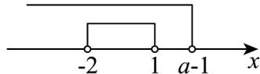

> [!faq]- 《专题01_集合高频题型精准突破_八大题型__高效培优期末专项训练_高一》官方解析
>
> > [!success]- **【答案】** A
>
> > [!note]- **【分析】**
> > 根据集合间的关系求出参数范围即可·
>
> > [!note]- **【解析】**
> > 由题意知，要满足 $A \subseteq B$ ，则有 $a - 1 \quad 1$ ，所以 $a \quad 2$ ：
> >
> > 
> >
> > 故选 **A**.
