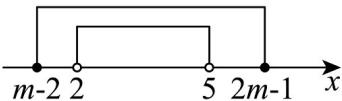
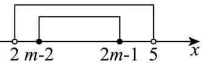

> [!faq]- 《专题01_集合高频题型精准突破_八大题型__高效培优期末专项训练_高一》官方解析
>
> > [!success]- **【答案】** (1)[3,4] (2) $(-∞,-1)$
>
> > [!note]- **【分析】**
> > （ $^{1}$ ）利用集合间的关系，计算参数范围即可；
> >
> > (2) 利用集合间的关系，分类讨论计算参数范围即可
>
> > [!note]- **【解析】**
> > （1）当 $A \subseteq B$ 时，如图，此时 $B \neq \emptyset$
> >
> > 则 $\left\{ \begin{array}{ll}m - 2\leq 2,\\ 2m - 1\quad 5, \end{array} \right.$ ，即 $\left\{ \begin{array}{ll}m\leq 4,\\ m\quad 3, \end{array} \right.$ ，因此 $m$ 的取值范围为[3,4]
> >
> > 
> >
> > (2) 当 $B \neq \varnothing$ 时，如图，
> >
> > 此时 $\left\{ \begin{array}{ll}m - 2 > 2,\\ 2m - 1 <   5,\\ 2m - 1\quad m - 2, \end{array} \right.$ ，解得 $\left\{ \begin{array}{ll}m > 4,\\ m <   3,\\ m\quad -1, \end{array} \right.$ ，此时无解；
> >
> > 
> >
> > 当 $B = \emptyset$ 时，由 $m - 2 > 2m - 1$ ，解得 $m < -1$
> >
> > 综上可得： $m$ 的取值范围为 $(- \infty, -1)$
