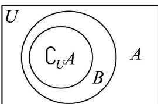

> [!faq]- 《专题01_集合高频题型精准突破_八大题型__高效培优期末专项训练_高一》官方解析
>
> > [!success]- **【答案】** D
>
> > [!note]- **【分析】**
> > 根据给定条件，借助韦恩图判断 $^{ABC}$ 三个选项；结合集合的包含关系推理判断D.
>
> > [!note]- **【解析】**
> > 全集 U 的两个非空真子集 A，B 满足 $(\tilde{\mathbf{Q}}_{U}A) \cup B = B$ ，∴ $\tilde{\mathbf{Q}}_{U}A \subseteq B$
> >
> > 如图，当 $\tilde{\mathfrak{Q}}_U A \neq B$ 时， $A \cap B \neq \emptyset$ ，故 $\mathsf{A}$ 错误；
> >
> > 
> >
> > 由图知， $A \mid B \neq B$ ，集合 A 不是集合 B 的子集，故 BC 错误；
> >
> > $\because \tilde{\mathfrak{Q}}_{U}A\subseteq B,\therefore \tilde{\mathfrak{Q}}_{U}B\subseteq A,\therefore (\tilde{\mathfrak{Q}}_{U}B)\cup A = A$ ，故D正确.
> >
> > 故选：D.
> >
> > 48. 全集 $U = \{x \mid x - 1\}$ ， $A = \{x \mid 2 < x < 4\}$ ， $B = \{x \mid x - 3\}$ ， $C = \{x \mid a - 1 < x < 2a + 1\}$ ， $C \subseteq U$ ，若
> >
> > $\check{\mathfrak{Q}}_U(A \cup B) \cap C = \varnothing$ ，则下列 $a$ 的取值满足题意的有（ ）A. $a = -2$ B. $a = 0$ C. $a = 3$ D. $a = 4$
> >
> > 【答案】ACD
> > 【分析】利用并集补集定义求解 $\check{\mathfrak{Q}}_{U}(A\cup B)$ ，再分 C 为空集与非空集情况讨论，列出参数不等式求解即可·【详解】 $A = \{x\mid 2 <   x <   4\}$ ， $B = \{x\mid x\quad 3\}$ ， $A\cup B = \{x\vert x\rangle 2\}$
> >
> > $$
> > \because U = \left\{x \mid x \quad 1 \right\} \text {,} \therefore \tilde {\mathfrak {Q}} _ {U} (A \cup B) = \left\{x \mid 1 \leq x \leq 2 \right\}
> > $$
> >
> > 由 $\tilde{\mathfrak{Q}}_{U}(A\cup B)\cap C=\varnothing$ 且 $C=\left\{x\mid a-1<x<2a+1\right\}$
> >
> > 当 $C = \emptyset$ 时， $a - 1, 2a + 1$ ，即 $a \leq -2$ 符合题意；
> >
> > 当 $C \neq \emptyset$ 时， $\left\{ \begin{array}{ll} 1 \leq a - 1 < 2a + 1 \\ a - 1 & 2 \end{array} \right.$ ，解得 $a = 3$ ；
> >
> > 综上： $a \leq -2$ 或 a 3；
> >
> > 故选 **ACD**
