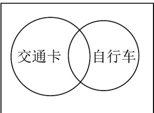

> [!faq]- 《专题01_集合高频题型精准突破_八大题型__高效培优期末专项训练_高一》官方解析
>
> > [!success]- **【答案】** 60 40
>
> > [!note]- **【分析】**
> > 本题可根据集合的性质，通过分析选 A 菜品和选 B 菜品的顾客人数，利用集合交集的性质来确定 A、B 两种菜品都选了的顾客人数的最大值和最小值。
>
> > [!note]- **【解析】**
> > 当选了 B 菜品的顾客也选了 A 菜品时，A,B 两种菜品都选了的顾客最多，最多有 60 名，
> >
> > 当这 $100$ 名顾客至少选了 $A, B$ 两种菜品中的一种时， $A, B$ 两种菜品都选了的顾客最少，
> >
> > 最少有 $80 + 60 - 100 = 40$ 名.
> >
> > 故答案为：60；40。
> >
> > 52．为解决上下班的交通问题，调查了某地 $^{100}$ 名职工，其中 $^{78}$ 人持有交通卡， $^{52}$ 人拥有自行车，而持有交通卡又有自行车的有 $^{37}$ 人，则既无交通卡又无自行车的共有\_\_\_\_人·
> >
> > 【答案】7
> >
> > 【分析】根据题意结合韦恩图运算求解即可·
> >
> > 【详解】作出韦恩图，如图所示：
> >
> > 
> >
> > 可知持有交通卡或有自行车的人数为 $78 + 52 - 37 = 93$
> >
> > 所以既无交通卡又无自行车的人数为 100 - 93 = 7 .
> >
> > 故答案为：7.
