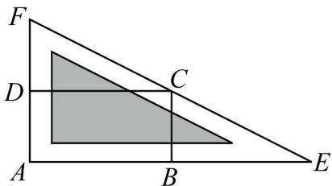

<!-- question-source:start -->
50．如图，有一个小矩形公园 ABCD，其中 $AB = 20m, AD = 10m$ ，现过点 C 修建一条笔直的围墙（不计宽度）与 AB 和 AD 的延长线分别交于点 E, F，现将小矩形公园扩建为三角形公园 AEF.

(1)当 $AE$ 多长时，才能使扩建后的公园 $\triangle AEF$ 的面积最小？并求出 $\triangle AEF$ 的最小面积.

(2)当扩建后的公园 $\triangle AEF$ 的面积最小时，要对其进行规划，要求中间为三角形绿地（图中阴影部分），周围是等宽的公园健步道，如图所示·若要保证绿地面积不小于总面积的 $\frac{3}{4}$ ，求健步道宽度的最大值·（小数点后保留三位小数）

参考数据： $\sqrt{3}\approx 1.732,\sqrt{5}\approx 2.236,\sqrt{15}\approx 3.873$

参考公式： $\tan 2\theta = \frac{2\tan\theta}{1 - \tan^2\theta}.$
<!-- question-source:end -->

![[高中/课堂同步/题库/人教A版高中数学同步讲义(2026)/01_必修第一册/期末/专项训练/专题04_一元二次不等式高频题型精准突破_八大题型__高效培优期末专项/_compact/answers/Q00066876A1.md]]
