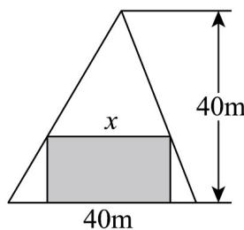
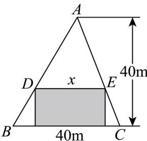

> [!faq]- 《专题04_一元二次不等式高频题型精准突破_八大题型__高效培优期末专项》官方解析
>
> > [!success]- **【答案】** D
>
> > [!note]- **【分析】**
> > 根据给定条件，利用一元二次不等式恒成立问题求解·
>
> > [!note]- **【解析】**
> > 当 a=2 时，-4<0 恒成立，则 a=2；
> >
> > 当 $a \neq 2$ 时， $\left\{ \begin{array}{l} a - 2 < 0 \\ \Delta = 4(a - 2)^2 + 16(a - 2) < 0 \end{array} \right.$ ，解得 $-2 < a < 2$
> >
> > 所以实数 a 的取值范围为 $(-2,2]$ .
> >
> > 故选：D
> >
> > ## 考点07 一元二次不等式在几何中的应用
> >
> > 49. 社区中心有一块三角形闲置空地，为打造居民休闲花园，计划在空地内规划种植区·在如图所示的锐角三角形空地中，欲建一个面积不小于 $300 \mathrm{~m}^{2}$ 的内接矩形花园（阴影部分），则其边长 $x$ （单位： $\mathrm{m}$ ）可以取（）
> >
> > 【答案】
> >
> > 
> >
> > A. 10 B. 20 C. 30 D. 40
> >
> > 【答案】ABC
> >
> > 【分析】设矩形的另一边长为 y，由三角形相似得出 x, y 的关系，再根据矩形的面积公式建立不等式即可求解.
> >
> > 【详解】设矩形的另一边长为 $y$ ，如图：
> >
> > 
> >
> > 由 $\mathrm{V}ADE$ 与 $\mathrm{V}ABC$ 相似得 $\frac{x}{40} = \frac{40 - y}{40}$ 且 $0 < x < 40, 0 < y < 40$
> >
> > 所以 $40 = x + y$ ，又矩形的面积 $xy \geq 300$
> >
> > 所以 $x(40-x)$ 300 即 $x^{2}-40x+300\leq0$ ，解得 $10\leq x\leq30$
> >
> > 故边长 x 可以取 10, 20, 30，即 ABC 符合题意，D 不符合题意.
> >
> > 故选 **ABC**
