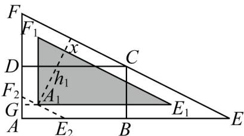

> [!faq]- 《专题04_一元二次不等式高频题型精准突破_八大题型__高效培优期末专项》官方解析
>
> > [!success]- **【答案】** (1)当 $AE = 40 \, m$ 时，公园 $\triangle AEF$ 的面积最小，为 $400 \, m^{2}$
>
> > [!note]- **【分析】**
> > （1）设 $AE = x(x > 20)$ ，由几何关系表示出 $\triangle AEF$ 的面积函数，结合基本不等式求最小值；
> >
> > (2) 如图所示，三角形绿地为 $\triangle A_{1}E_{1}F_{1}$ ，过 $A_{1}$ 作 $E_{2}F_{2} \parallel EF$ 交 $AE$ 、 $AF$ 于 $E_{2}$ 、 $F_{2}$ ，延长 $E_{1}A_{1}$ 交 $AF$ 于 $G$ ，设健步道宽度为 $x$ ，由几何关系求得 $\triangle A_{1}E_{1}F_{1}$ 中 $E_{1}F_{1}$ 上的高 $h_{1} = h - x - h_{2}$ （ $h_{2}$ 为 $\triangle AE_{2}F_{2}$ 中 $E_{2}F_{2}$ 上的高），即可由相似比表示出三角形绿地 $\triangle A_{1}E_{1}F_{1}$ 的面积函数不等式，从而求得结果·
>
> > [!note]- **【解析】**
> > （1）设 $AE = x(x > 20)$ ，矩形ABCD中， $CD\| AE$ ，则 $\frac{EB}{EA} = \frac{BC}{AF} \mathsf{P} \frac{x - 20}{x} = \frac{10}{AF}$ ， $\therefore AF = \frac{10x}{x - 20}$ ， $\therefore S_{\triangle AEF} = \frac{1}{2} \times x \times \frac{10x}{x - 20} = \frac{5x^2}{x - 20} = \frac{5(x^2 - 400) + 2000}{x - 20}$ $= 5(x - 20) + \frac{2000}{x - 20} + 200^3 \sqrt{5(x - 20) \times \frac{2000}{x - 20}} + 200 = 400$ ，
> >
> > 当且仅当 $5(x - 20) = \frac{2000}{x - 20} \mathsf{P} x = 40$ 时，等号成立.
> >
> > 故当 $AE = 40 \, m$ 时，公园 $\triangle AEF$ 的面积最小，为 $400 \, m^{2}$ ；
> >
> > (2) 由题意得， $AE = 40m$ ， $AF = 20m$ ， $\tan \angle AEF = \frac{1}{2}$ ， $\sin \textcircled{D} AEF = \frac{20}{\sqrt{20^2 + 40^2}} = \frac{\sqrt{5}}{5}$ ， $\triangle AEF$ 中 $EF$ 上的高为 $h = \frac{AE \times AF}{EF} = \frac{40' 20}{\sqrt{40^2 + 20^2}} = 8\sqrt{5}$ ，
> >
> > 如图所示，三角形绿地为 $\triangle A_{1}E_{1}F_{1}$ ，过 $A_{1}$ 作 $E_{2}F_{2}\parallel EF$ 交 AE、AF 于 $E_{2}$ 、 $F_{2}$ ，延长 $E_{1}A_{1}$ 交 AF 于 G，易得 $\triangle AE_{2}F_{2}\sim\triangle AEF\sim\triangle A_{1}E_{1}F_{1}$ .
> >
> > 
> >
> > 设健步道宽度为 x，则 $AF_{2}=AG+GF_{2}=x+x\tan\Phi AE_{2}F_{2}=x+x\tan\Phi AEF=\frac{3}{2}x$
> >
> > 设 $\triangle AE_{2}F_{2}$ 中 $E_{2}F_{2}$ 上的高 $h_2$ ，则 $\frac{h_2}{h} = \frac{AF_2}{AF} \mathsf{P}$ $h_2 = \frac{\frac{3}{2}x}{20} \times 8\sqrt{5} = \frac{3\sqrt{5}}{5} x$
> >
> > 则 $\triangle A_{1}E_{1}F_{1}$ 中 $E_{1}F_{1}$ 上的高 $h_1 = h - x - h_2 = 8\sqrt{5} - \frac{\text{a}}{\text{c}} + \frac{3\sqrt{5}}{5}\frac{\ddot{\text{o}}}{\dot{\varphi}}x > 0$
> >
> > 由 $\frac{S_{\triangle A_{1}E_{1}F_{1}}}{S_{\triangle AEF}}=\frac{\frac{\alpha h_{1}}{\dot{e}}h_{2}\ddot{\varnothing}^{2}}{\dot{e}}$ 得 $S_{\triangle A_{1}E_{1}F_{1}}=\frac{\frac{5\frac{\alpha e}{\dot{e}}8\sqrt{5}-\frac{\alpha e}{\dot{e}}1+\frac{3\sqrt{5}}{5}\frac{\ddot{o}}{\dot{e}}x\frac{\ddot{o}^{2}}{\dot{e}}}{4}}{3}\frac{3}{4}S_{\triangle AEF}=300$ ，解得 x£1.024
> >
> > 故健步道宽度的最大值为 $1.024 \mathrm{~m}$
