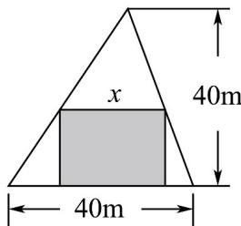

> [!faq]- 《专题04_一元二次不等式高频题型精准突破_八大题型__高效培优期末专项》官方解析
>
> > [!success]- **【答案】**  A $15\leq x\leq 30$ B $12\leq x\leq 25$ C $10\leq x\leq 30$ D $20\leq x\leq 30$
>
> > [!note]- **【分析】**
> > 根据三角形相似列出方程，将矩形的另一边用 y 表示，再根据矩形的面积不小于 $300 ~m^{2}$ 列出不等式，即可求出结果·
>
> > [!note]- **【解析】**
> > 设矩形的另一边长为 $y^{m}$ ，则由三角形相似知， $\frac{x}{40} = \frac{40 - y}{40}$ ，
> >
> > 所以 $y = 40 - x$ ，因为 $xy \geq 300$ ，所以 $x(40 - x) \geq 300$
> >
> > 即 $x^{2} - 40x + 300 \leq 0$ ，解得 $10 \leq x \leq 30$ ：
> >
> > 故选 **C**
>
> > [!tip]- **【名师点睛】**
> > 本题主要考查了一元二次不等式的应用，关键是建立数学模型，解一元二次不等式，属于基础题·53．已知 $f(x)=a-|x-b|(a>0)$ ，且 $f(x)=0$ 的解集为 $\{x|-3\leq x\leq7\}$ .
> >
> > (1) 求实数 a, b 的值；
> >
> > (2) 若 $f(x)$ 的图像与直线 x=0 及 $y=m(m<3)$ 围成的四边形的面积不小于 14，求实数 m 取值范围.
> >
> > 【答案】（1）a=5，b=2；（2） $(-∞,1]$
> >
> > 【分析】（1）解绝对值不等式得 $b-a\leq x\leq b+a$ ，根据不等式的解集为 $\left\{x\mid-3\leq x\leq7\right\}$ 列出方程组，解出即可；（2）求出 $f(x)$ 的图像与直线x=0及 $y=m(m<3)$ 交点的坐标，通过分割法将四边形的面积分为两个三角形，列出不等式，解不等式即可·
> >
> > 【详解】（1）由 $f(x)$ 0得： $|x - b| \leq a$ ， $b - a \leq x \leq b + a$ ，
> >
> > 即 $\left\{ \begin{array}{l} b - a = -3 \\ b + a = 7 \end{array} \right.$ ，解得 $a = 5$ ， $b = 2$ 。
> >
> > (2) $f(x) = 5 - |x - 2| = \begin{cases} 7 - x, & x = 2 \\ 3 + x, & x < 2 \end{cases}$ 的图像与直线 $x = 0$ 及 $y = m$ 围成的四边形 $ABCD$ , $A(2,5)$ , $B(0,3)$ , $C(0,m)$ , $D(7 - m,m)$ .
> >
> > 过 A 点向 y = m 引垂线，垂足为 $E(2, m)$ ，则 $S_{ABCD} = S_{ABCE} + S_{AED} = \frac{1}{2}(3 - m + 5 - m) \times 2 + \frac{1}{2}(5 - m)^{2}$ 14.
> > 化简得： $m^{2}-14m+13\quad0,\quad m\quad13$ （舍）或 $m\leq1$ .
> >
> > 故 m 的取值范围为 $(-∞,1]$ .
> >
> > 54．一般地，把 $b - a$ 称为区间 $(a,b)$ 的“长度”已知关于 $x$ 的不等式 $x^{2} - kx + 2k < 0$ 有实数解，且解集区间长度不超过3个单位，则实数 $k$ 的取值范围为\_\_\_\_。
> >
> > 【答案】 $\left[-1,0\right)\cup(8,9]$
> >
> > 【分析】不等式 $x^{2} - kx + 2k < 0$ 有实数解等价于 $x^{2} - kx + 2k = 0$ 有两个不相等的实数根，结合根的判别式，韦达定理进行求解：
> >
> > 【详解】不等式 $x^{2} - kx + 2k < 0$ 有实数解等价于 $x^{2} - kx + 2k = 0$ 有两个不相等的实数根，则 $\Delta = (-k)^{2} - 8k > 0$ ，解得： $k > 8$ 或 $k < 0$
> >
> > 设 $x^{2} - kx + 2k = 0$ 的两根为 $x_{1}$ ， $x_{2}$ ，不妨令 $x_{1} <   x_{2}$ ，则 $x_{1} + x_{2} = k$ ， $x_{1}x_{2} = 2k$
> >
> > 由题意得： $x_{2} - x_{1} = \sqrt{\left(x_{2} + x_{1}\right)^{2} - 4x_{1}x_{2}} = \sqrt{k^{2} - 8k}\leq 3$ ，解得： $-1\leq k\leq 9$ ，结合 $k > 8$ 或 $k < 0$ ，所以实数 $k$ 的取值范围为 $[-1,0)\cup (8,9]$
> >
> > 故答案为： $\left[-1,0\right)\cup(8,9]$
> >
> > ## 考点 08 已知条件判断不等式是否正确
