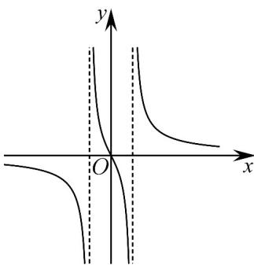

<!-- question-source:start -->
55. 在数学中，常用函数图象来研究函数性质，也常用函数解析式来分析函数图象的特征·已知函数 $f(x)$

的部分图象如图所示，则函数 $f(x)$ 的解析式可能为（）

A. $f(x) = \frac{2x}{x^2 - 1}$ B. $f(x) = \frac{2x}{x^2 + 1}$ C. $f(x) = \frac{2x}{1 - |x|}$ D. $f(x) = \frac{x^2 + 1}{x^2 - 1}$
<!-- question-source:end -->

![[高中/课堂同步/题库/人教A版高中数学同步讲义(2026)/01_必修第一册/期末/专项训练/专题05_函数的定义域及值域高频题型精准突破_八大题型__高效培优期末/_compact/answers/Q00066928A1.md]]
