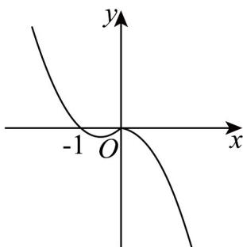

> [!faq]- 《专题05_函数的定义域及值域高频题型精准突破_八大题型__高效培优期末》官方解析
>
> > [!success]- **【答案】** $(- \infty, \sqrt{2}]$
>
> > [!note]- **【分析】**
> > 依题意可得 $f(x) = \begin{cases} -x^2, & x > 0 \\ 0, & x = 0 \\ x^2 + x, & x < 0 \end{cases}$ ，画出的大致图象，从而即可分析出若，则 $f(x) \leq 2$
> >
> > $f^{2}(a) + f(a)\leq 2$ ，进而即可求出实数 $a$ 的取值范围.
>
> > [!note]- **【解析】**
> > 由 $\operatorname{sgn}(x)=\left\{\begin{aligned}&1,x>0\\ &0,x=0\\ &-1,x<0\end{aligned}\right.$ ，则 $f(x)=\frac{1}{2}\left[x-\operatorname{sgn}(x)\cdot\left(2x^{2}+x\right)\right]=\left\{\begin{aligned}&-x^{2},x>0\\ &0,x=0\\ &x^{2}+x,x<0\end{aligned}\right.$
> >
> > 所以 $f(x)$ 的图象如下图所示，
> >
> > 
> >
> > 若 $f[f(a)] \leq 2$ （\*），由分段函数可知：
> >
> > 当 $f(a) < 0$ 时，由（ $^*$ ）可得 $f^2 (a) + f(a)\leq 2$ ，即 $[f(a) + 2][f(a) - 1]\leq 0$ ，解得 $f(a) - 2$
> >
> > 当 $f(a) = 0$ 时，由（ $^*$ ）可得 $0 \leq 2$ 恒成立；
> >
> > 当 $f(a)>0$ 时，由（ $^{*}$ ）可得 $-f^{2}(a)\leq2$ 恒成立.
> >
> > 综上可得 $f(a) - 2$
> >
> > 若 $a < 0$ ，则有 $a^2 + a - 2$ ，即 $\left(a + \frac{1}{2}\right)^2 - \frac{7}{4}$ 恒成立；
> >
> > $a = 0$ ，则有 $0 - 2$ 恒成立；
> >
> > 若 $a > 0$ ，则有 $-a^2 - 2$ ，解得 $0 < a \leq \sqrt{2}$
> >
> > 综上分析，实数 $a$ 的取值范围是 $(- \infty, \sqrt{2}]$
> >
> > 故答案为： $(- \infty, \sqrt{2}]$
