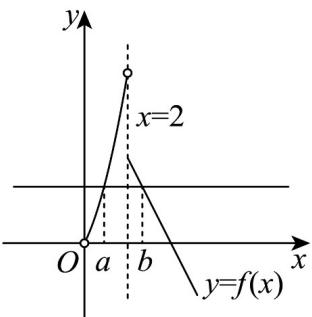

> [!faq]- 《专题05_函数的定义域及值域高频题型精准突破_八大题型__高效培优期末》官方解析
>
> > [!success]- **【答案】** A
>
> > [!note]- **【分析】**
> > 根据题意由 $f(a) = f(b), a < b$ 得 $2a + a^2 = 8 - 2b$ ， $0 < a < 2, b$ 得到 $a - b = \frac{1}{2} a^2 + 2a - 4$ ，构造函数 $y = \frac{1}{2} a^2 + 2a - 4$ ，利用单调性即可求解。
>
> > [!note]- **【解析】**
> > 因为当 $0 < x < 2$ 时， $f(x)$ 单调递增，当 $x = 2$ 时， $f(x)$ 单调递减，
> >
> > 所以 $0 < a < 2, b \quad 2$ 。由 $2a + a^2 = 8 - 2b$ ，得 $b = 4 - a - \frac{1}{2} a^2$ ，
> >
> > 所以 $a - b = \frac{1}{2} a^2 + 2a - 4$ 。令 $0 < a^2 + 2a \leq 4$ ，得 $a \in (0, \sqrt{5} - 1]$ ，
> >
> > 因为 $y = \frac{1}{2} a^2 + 2a - 4$ 在 $(0, \sqrt{5} - 1]$ 上单调递增，
> >
> > 所以 $a - b \in (-4, \sqrt{5} - 3]$
> >
> > 故选：A.
> >
> > 
