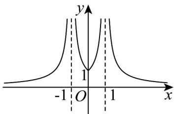
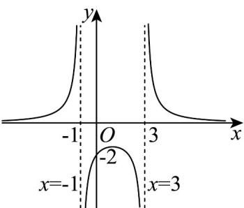
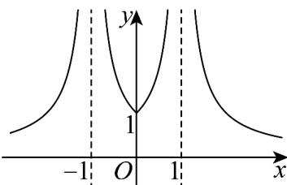

> [!faq]- 《专题05_函数的定义域及值域高频题型精准突破_八大题型__高效培优期末》官方解析
>
> > [!success]- **【答案】** -1
>
> > [!note]- **【分析】**
> > 根据分段函数解析式计算可得·
>
> > [!note]- **【解析】**
> > 因为 $f(x) = \begin{cases} x^2 - 2x (x < 1) \\ -x + 2(x - 1) \end{cases}$ ，所以 $f(-1) = (-1)^2 - 2 \times (-1) = 3$ ，
> >
> > 所以 $f(f(-1)) = f(3) = -3 + 2 = -1$ .
> >
> > 故答案为：-1
> >
> > ## 考点07 根据函数图像求解析式
> >
> > 49. 我国著名数学家华罗庚曾说：“数缺形时少直观，形缺数时难入微，数形结合百般好，隔裂分家万事休。”在数学的学习和研究中，常用函数的图象来研究函数的性质，也常用函数的解析式来研究函数图象的特征。我们从这个商标中抽象出一个图象如图，其对应的函数可能是（）
> >
> > 【答案】
> >
> > 
> >
> > 
> >
> > A. $f(x) = \frac{1}{|x - 1|}$ B. $f(x) = \frac{1}{\|x| - 1|$ C. $f(x) = \frac{1}{x^2 - 1}$ D. $f(x) = \frac{1}{x^2 + 1}$
> >
> > 【答案】B
> >
> > 【分析】由图象知函数的定义域排除选项 A、D，再根据 $f(0) = -1$ 不成立排除选项 C，即可得正确选项。
> > 【详解】因为函数 $f(x)=\frac{1}{|x-1|}$ 的定义域为 $\left\{x\mid x\neq1\right\}$ ，函数 $f(x)=\frac{1}{x^{2}+1}$ 的定义域为 R，
> > 函数 $f(x)=\frac{1}{\left|\left|x\right|-1\right|}$ 与 $f(x)=\frac{1}{x^{2}-1}$ 的定义域均为 $\left\{x\mid x\neq\pm1\right\}$ .
> > 由图知 $f(x)$ 的定义域为 $\left\{x\mid x\neq\pm1\right\}$ ，排除选项 A、D，
> > 对于 $f(x)=\frac{1}{x^{2}-1}$ ，当 x=0 时， $f(0)=-1$ ，不符合图象 $f(0)=1$ ，所以排除选项 C.
> > 故选：B.
> >
> > 50. 函数 $f(x) = \frac{a}{x^2 + bx + c}$ 的部分图像如图（粗实曲线），则 $a = ()$
> >
> > 
> >
> > A.8 B.6 C.4 D.2
> >
> > 【答案】B
> >
> > 【分析】由函数图像知道定义域，从而求出参数 $b, c$ 的值，再代入点 $(0, -2)$ 即可求出 $a$ 的值。【详解】由函数图像可知，函数定义域 $x \in (-\infty, -1) \cup (-1, 3) \cup (3, +\infty)$ ，即 $x^2 + bx + c \neq 0$ 的解集为 $x \neq -1, x \neq 3$ ，也就是即 $x^2 + bx + c = 0$ 的解为 $x = -1, x = 3$ ， $\therefore \left\{ \begin{array}{l} (-1)^2 + b \times (-1) + c = 0 \\ 3^2 + b \times 3 + c = 0 \end{array} \right.$ ， $\therefore \left\{ \begin{array}{l} 1 - b + c = 0 \\ 9 + 3b + c = 0 \end{array} \right.$ ， $\therefore \left\{ \begin{array}{l} b = -2 \\ c = -3 \end{array} \right.$ ，
> >
> > $\because$ 函数图像经过点 $(0, -2)$ , $\therefore f(0) = \frac{a}{0^2 - 2 \times 0 - 3} = -2$ , $\therefore a = 6$ .
> >
> > 故选：B.
> >
> > 51. 我国著名数学家华罗庚曾说：“数缺形时少直观，形缺数时难入微，数形结合百般好，隔裂分家万事休”在数学的学习和研究中，常用函数的图象来研究函数的性质，也常用函数的解析式来研究函数图象的
> >
> > 特征·下面的图象对应的函数可能是（）
> >
> > 
> >
> > A. $f(x) = \frac{1}{|x| - 1}$ B. $f(x) = \frac{1}{\|x| - 1}$ C. $f(x) = \frac{1}{x^3 + 1}$ D. $f(x) = \frac{1}{x^2 + 1}$
> >
> > 【答案】B
> >
> > 【分析】首先由函数的定义域排除 CD，再由 0 < x < 1 时， $f(x) < 0$ 排除 A，即可得答案
> > 【详解】由图象可知，函数的定义域为 $(-∞,-1)∪(-1,1)∪(1,+∞)$ ，
> >
> > 因为 $f(x) = \frac{1}{x^3 + 1}$ 的定义域为 $(- \infty, -1) \cup (-1, +\infty)$ ，所以排除 $\mathbb{C}$ ，
> >
> > 因为 $f(x)=\frac{1}{x^{2}+1}$ 的定义域为 R，所以排除 D，
> >
> > 因为当 $0 < x < 1$ 时， $f(x) = \frac{1}{|x| - 1} < 0$ ，所以排除A，
> >
> > 故选 **B**
