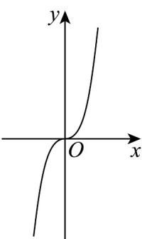
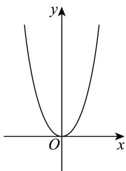
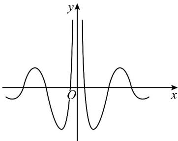
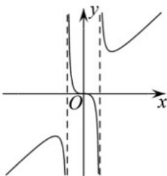

> [!faq]- 《专题05_函数的定义域及值域高频题型精准突破_八大题型__高效培优期末》官方解析
>
> > [!success]- **【答案】**  图1  图2 A. $x^{2}f(x)$ B. $\frac{f(x)}{x^2}$ C. $xf(x)$ D. $xf^{2}(x)$
>
> > [!note]- **【分析】**
> > 对于 $^{ABD}$ ，可得到当x<0时， $x^{2}f(x)<0$ ， $\frac{f(x)}{x^{2}}<0$ ， $xf^{2}(x)<0$ ，从而 $^{ABD}$ 错误， $^{C}$ 满足要求。
>
> > [!note]- **【解析】**
> > 对于A，由图1可得，当x<0时， $f(x)<0$ ，
> > 所以当x<0时， $x^{2}f(x)<0$ ，故A错误；
> > 对于 $^{B}$ ，由图1可得当x<0时， $f(x)<0$ ，所以当x<0时， $\frac{f(x)}{x^{2}}<0$ ，故B错误；
> > 对于 $^{C}$ ，由图1可得当x<0时， $f(x)<0$ ，当x>0时， $f(x)>0$ ，
> > 所以当x<0时， $xf(x)>0$ ；当x>0时， $xf(x)>0$ ，选项 $^{C}$ 正确；
> > 对于 $^{D}$ ，由图1可得当x<0时， $f(x)<0$ ，则当x<0时， $f^{2}(x)>0$ ， $xf^{2}(x)<0$ ，
> > 选项 $^{D}$ 错误·
> >
> > 故选：C.
> >
> > 
> >
> > 53. 著名数学家华罗庚先生曾说过：“数缺形时少直观，形缺数时难入微，数形结合百般好，隔裂分家万事休”在数学的学习和研究中，我们经常用函数的图象来研究函数的性质，也经常用函数的解析式来琢磨函数的图象特征，如某体育品牌的LOGO为\_\_\_\_，可抽象为如图所示的轴对称的优美曲线，下列函数中，其图象大致可“完美”局部表达这条曲线的函数是（）
> >
> > 【答案】
> >
> > 
> >
> > A. $f(x) = \frac{\sin 3x}{4^{-x} - 4^x}$ B. $f(x) = \frac{\cos 3x}{4^{-x} - 4^x}$ C. $f(x) = \frac{\cos 3x}{\left|4^x - 4^{-x}\right|}$ D. $f(x) = \frac{\sin 3x}{\left|4^x - 4^{-x}\right|}$
> >
> > 【答案】C
> >
> > 【分析】首先根据图像判断函数是一个偶函数，再根据图像趋势知道 $(0, +\infty)$ 区间一开始是单调递减的，由此判断选项中哪个符合即可·
> >
> > 【详解】由图可知，该函数是一个偶函数， $y = \sin 3x$ 是奇函数， $y = \cos 3x$ 是偶函数， $y = \frac{1}{4^{-x} - 4^x}$ 是奇函数， $y = \frac{1}{\left|4^{-x} - 4^x\right|}$ 是偶函数，根据偶函数×奇函数=奇函数，可知BD错误； $y = \cos 3x$ 在 $(0, +\infty)$ 区间先是单调递减的， $y = \frac{1}{4^{-x} - 4^x}$ 在 $(0, +\infty)$ 区间是单调递减的，因此 $f(x) = \frac{\cos 3x}{\left|4^x - 4^{-x}\right|}$ 符合图形先单调递减·故选：C
> >
> > 54. 函数 $f(x)$ 的部分图象如图所示，则 $f(x)$ 的解析式可能是（）
> >
> > 【答案】
> >
> > 
> >
> > A. $f(x) = \frac{x^3}{1 - |x|}$
> >
> > $$
> > f (x) = \frac {x}{x ^ {2} + 1}
> > $$
> >
> > $$
> > f (x) = \frac {x ^ {3}}{x ^ {2} - 1}
> > $$
> >
> > $$
> > f (x) = \frac {x ^ {2} + 1}{x ^ {2} - 1}
> > $$
> >
> > 【答案】C
> >
> > 【分析】由函数 $f(x)$ 的奇偶性以及定义域判断 BD，由 $f(2)=\frac{2^{3}}{1-|2|}=-8<0$ 判断 AC.
> >
> > 【详解】由图可知，函数 $f(x)$ 为奇函数，且定义域不是 $R\cdot$
> >
> > 对于 B， $f(x)=\frac{x}{x^{2}+1}$ 的定义域为 R，故 B 错误；
> >
> > 对于 D， $f(-x)=\frac{x^{2}+1}{x^{2}-1}=f(x)$ ，即该函数为偶函数，故 D 错误；
> >
> > 对于 AC，两个函数的定义域都为 $\{x \neq x \neq \pm1\}$ ，因为 $f(2)=\frac{2^{3}}{1-|2|}=-8<0$ ，所以 A 错误，C 正确；
> >
> > 故选 **C**
