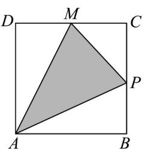
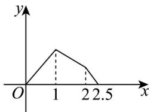
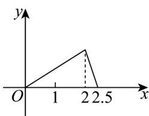
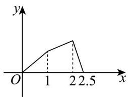
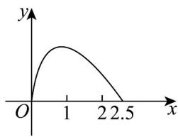

> [!faq]- 《专题05_函数的定义域及值域高频题型精准突破_八大题型__高效培优期末》官方解析
>
> > [!success]- **【答案】**  A  B C  D E. 均不是  
>
> > [!note]- **【分析】**
> > 求出点 $P$ 在对应线段上时的解析式，结合图象判断即可得·
>
> > [!note]- **【解析】**
> > 当点 $P$ 在 $AB$ 上时， $y = \frac{1}{2} \times AP \times BC = \frac{x}{2}$ ，
> > 当点 $P$ 在 $BC$ 上时， $y = AB \times BC - \frac{1}{2} \times AB \times BP - \frac{1}{2} AD \times DM - \frac{1}{2} MC \times CP = 1 - \frac{1}{2}(x - 1) - \frac{1}{2} \times \frac{1}{2} - \frac{1}{2} \times \frac{1}{2}(2 - x) = \frac{3}{4} - \frac{x}{4}$ ，
> > 当点 $P$ 在 $CM$ 上时， $y = \frac{1}{2} \times AD \times PM = \frac{1}{2}\left(\frac{5}{2} - x\right) = \frac{5}{4} - \frac{1}{2} x$ ，
> > 其中A选项符合要求，B、C、D都不符合要求，故A正确·
> >
> > 故选 **A**.
