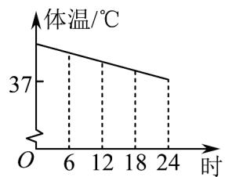
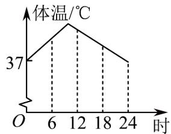
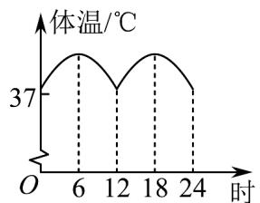
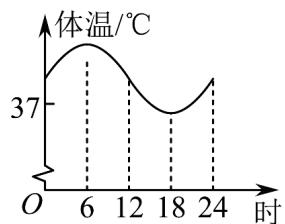
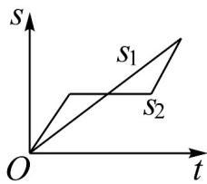
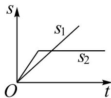
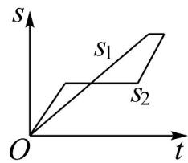
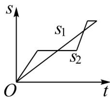

> [!faq]- 《专题05_函数的定义域及值域高频题型精准突破_八大题型__高效培优期末》官方解析
>
> > [!success]- **【答案】**  B  C  D 
>
> > [!note]- **【分析】**
> > 根据火炬的形状：中间细、上下粗来分析剩余燃料的高度 $h$ 随时间 $t$ 变化的下降速度·
>
> > [!note]- **【解析】**
> > 由图可知，该火炬中间细，上下粗，燃烧时燃料以均匀的速度消耗，
> > 燃料在燃烧时，燃料的高度一直在下降，刚开始时下降的速度越来越快，
> > 燃料液面到达火炬最细处后，燃料的高度下降得越来越慢，
> > 结合所得的函数图象， $^{A}$ 选项较为合适·
> >
> > 故选：A.
> >
> > 60. “龟兔赛跑”讲述了这样的故事：领先的兔子看着慢慢爬行的乌龟，骄傲起来，睡了一觉，当它醒来时，发现乌龟快到终点了，于是急忙追赶，但为时已晚，乌龟还是先到达了终点·用 $S_{1}$ ， $S_{2}$ 分别表示乌龟和兔子经过的路程，t 为时间，则与故事情节相吻合的是（）
> >
> > 【答案】
> >
> > A
> >
> > 
> >
> > B
> >
> > 
> >
> > 
> >
> > C
> >
> > D
> >
> > 
> >
> > 【答案】B
> >
> > 【分析】关键是根据题意判断关于 t 的函数 $S_{1}, S_{2}$ 的性质以及其图象.
> >
> > 【详解】由题意可得 $S_{1}$ 始终是匀速增长, 开始时, $S_{2}$ 的增长比较快, 但中间有一段时间 $S_{2}$ 停止增长, 在最后一段时间里, $S_{2}$ 的增长又较快, 但 $S_{2}$ 的值没有超过 $S_{1}$ 的值, 结合所给的图象可知, B 选项正确;
> >
> > 故选 **B**.
