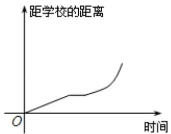
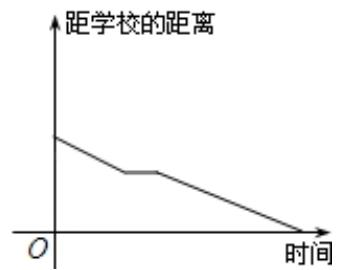
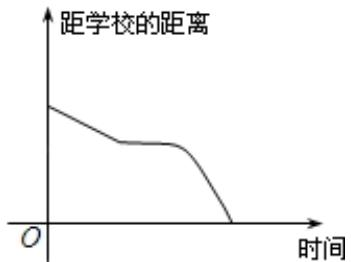
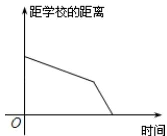

> [!faq]- 《专题05_函数的定义域及值域高频题型精准突破_八大题型__高效培优期末》官方解析
>
> > [!success]- **【答案】** A  B  C  D 
>
> > [!note]- **【分析】**
> > 先研究四个选项中图象的特征，再对照小明上学路上的运动特征，两者对应即可选出正确选项·
>
> > [!note]- **【解析】**
> > 考查四个选项，横坐标表示时间，纵坐标表示的是离开学校的距离，由此知，此函数图象一定是下降的，由此排除A；
> > 再由小明骑车上学，开始时匀速行驶可得出图象开始一段是直线下降型，又途中因交通堵塞停留了一段时间，故此时有一段函数图象与 $x$ 轴平行，由此排除D，
> > 之后为了赶时间加快速度行驶，此一段时间段内函数图象下降的比较快，由此可确定C正确，B不正确．
> >
> > 故选 **C**．
