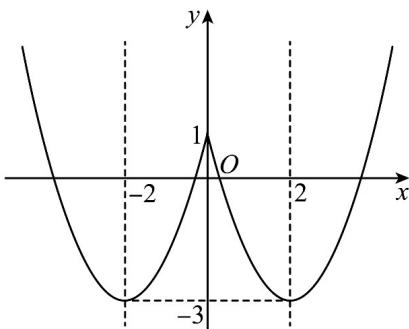
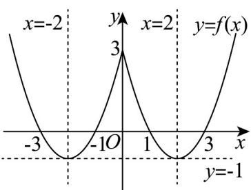

> [!faq]- 《专题06_函数基本性质高频题型精准突破_八大题型__高效培优期末专项训》官方解析
>
> > [!success]- **【答案】** (1) 函数 $y = f(x)$ 在 $(-∞, -2]$ 上是单调递增 (2) 函数 $y = f(x)$ 在 $[-2,0]$ 上是单调递增 (3) 当 $x = 0$ 时，函数 $y = f(x)$ 有最大值 (4) 当 x = -2 或 x = 2 时，函数 $y = f(x)$ 有最小值
>
> > [!note]- **【分析】**
> > 作出函数图象，结合图象分析即可得出答案·
>
> > [!note]- **【解析】**
> > $f(x) = x^{2} - 4|x| + 1 = \left\{ \begin{array}{ll}x^{2} - 4x + 1,x & 0\\ x^{2} + 4x + 1,x <   0 \end{array} \right.$ ，作出函数 $f(x)$ 的图象如下：
> >
> > 
> >
> > 由图象可知函数 $y = f(x)$ 在 $(- \infty, -2]$ 上是单调递减，在 $[-2, 0]$ 上是单调递增，
> >
> > 故 $(1)$ 错误， $(2)$ 正确；
> >
> > 由图象可知 $f(x)$ 在 $x = -2$ 或 $x = 2$ 时，函数 $y = f(x)$ 有最小值，没有最大值，
> >
> > 故 $( ^{3} )$ 错误， $( ^{4} )$ 正确；
> >
> > 故答案为： $(2)(4)$
> >
> > 3. 函数 $f(x) = (1 - x) \cdot |2 - x|$ 的单调递增区间为（）
> >
> > 【答案】
> >
> > A. $(\frac{3}{2}, 2)$ B. $(1, \frac{3}{2})$ C. $(- \infty, \frac{3}{2})$ D. $(\frac{3}{2}, +\infty)$
> >
> > 【答案】A
> >
> > 【分析】化函数为分段函数，再结合二次函数单调性求出单调递增区间·
> >
> > 【详解】函数 $f(x) = (1 - x)\cdot |2 - x| = \left\{ \begin{array}{ll}x^{2} - 3x + 2,x <   2\\ -x^{2} + 3x - 2,x\quad 2 \end{array} \right.$
> >
> > 当 $x$ 2时， $f(x) = -x^2 + 3x - 2$ 在 $[2, +\infty)$ 上单调递减，
> >
> > 当 $x < 2$ 时， $f(x) = x^2 - 3x + 2$ 在 $(- \infty, \frac{3}{2})$ 上单调递减，在 $(\frac{3}{2}, 2)$ 上单调递增，所以函数 $f(x)$ 的单调递增区间为 $(\frac{3}{2}, 2)$ .
> >
> > 故选：A
> >
> > 4. 函数 $f(x) = x^2 - 4|x| + 3$ 的单调递增区间是（）
> >
> > 【答案】
> > A. $(- \infty, -2)$ B. $(- \infty, -2)$ 和 $(0, 2)$ C. $(-2, 2)$ D. $(-2, 0)$ 和 $(2, +\infty)$
> >
> > 【答案】D
> >
> > 【分析】作出 $f(x)$ 的图象，结合图象可得单调区间·
> >
> > 【详解】因为 $f(x)=x^{2}-4|x|+3=\left\{\begin{aligned}x^{2}-4x+3,x&0\\ x^{2}+4x+3,x&<0\end{aligned}\right.$
> >
> > 作出 $f(x)$ 的图象，如图所示，
> >
> > 
> >
> > 由图象可知：函数 $f(x)$ 的单调递增区间是 $(-2,0)$ 和 $(2,+\infty)$ .
> >
> > 故选 **D**.
