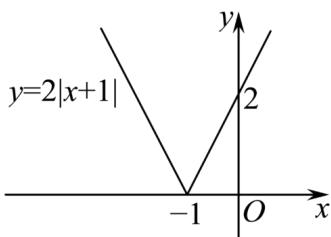

> [!faq]- 《专题06_函数基本性质高频题型精准突破_八大题型__高效培优期末专项训》官方解析
>
> > [!success]- **【答案】** A．若对任意 $x_{1}$ ， $x_{2}\in I$ ， $\frac{f(x_{1})-f(x_{2})}{x_{1}-x_{2}}>0$ ，则 $y=f(x)$ 在I上单调递增 B．函数 $y=2|x+1|$ 的递减区间是 $(-∞,-1]$ C．函数 $y=-\frac{1}{x}$ 在定义域上是增函数 D．函数 $y=\frac{1}{x}$ 的单调减区间是 $(-∞,0)$ 和 $(0,+∞)$
>
> > [!note]- **【分析】**
> > 根据函数的单调性定义判断 $^{A}$ ，利用函数图象判断 $^{B}$ ，由反比例函数性质判断 $^{CD}$ 。
>
> > [!note]- **【解析】**
> > 对于 $^{A}$ ：若对任意 $x_{1}$ ， $x_{2}\in I$ ， $\frac{f(x_{1})-f(x_{2})}{x_{1}-x_{2}}>0$ ，显然 $x_{1}\neq x_{2}$ ，
> > 当 $x_{1}<x_{2}$ 时，则有 $f(x_{1})<f(x_{2})$ ；当 $x_{1}>x_{2}$ 时，则有 $f(x_{1})>f(x_{2})$ ；
> > 由函数单调性的定义可知 $y=f(x)$ 在I上是增函数，故 $^{A}$ 正确。
> > 对于 $^{B}$ ：作出函数 $y=2|x+1|$ 的图象，如图所示，
> >
> > 
> >
> > 由图象可知：函数 $y = 2|x + 1|$ 的递减区间是 $(- \infty, -1]$ ，故 $B$ 正确；
> >
> > 对于 $C$ ：由反比例函数单调性可知， $y = -\frac{1}{x}$ 在 $(- \infty, 0)$ 和 $(0, +\infty)$ 上单调递增，故 $C$ 错误；对于 $D$ ：由反比例函数单调性可知， $y = \frac{1}{x}$ 单调减区间是 $(- \infty, 0)$ 和 $(0, +\infty)$ ，故 $D$ 正确。
> >
> > 故选 **ABD**。
