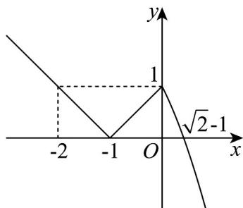

> [!faq]- 《专题06_函数基本性质高频题型精准突破_八大题型__高效培优期末专项训》官方解析
>
> > [!success]- **【答案】** C
>
> > [!note]- **【分析】**
> > 根据给定的分段函数，分段探讨函数的取值，再利用函数在开区间上既有最大值又有最小值的条件，列式求解即可·
>
> > [!note]- **【解析】**
> > 由题意，当 $x \leq 0$ 时， $f(x) = |x + 1|$
> >
> > 根据图像，可得当 $x \leq -1$ 时， $f(x)$ 单调递减，值域为 $[0, +\infty)$
> >
> > 当 $-1 \leq x \leq 0$ 时， $f(x)$ 单调递增，值域为 $[0,1]$ ，
> >
> > 当 $x \leq -1$ 时，由 $f(x) = 1$ ，解得 $x = -2$
> >
> > 
> >
> > 当 $x > 0$ 时， $f(x) = -x^2 - 2x + 1$
> >
> > 根据图像，当 x > 0 时， $f(x)$ 单调递减，值域为 $(-∞, 1)$ ，
> >
> > 当 $x > 0$ 时，由 $f(x) = 0$ ，解得 $x = \sqrt{2} -1$
> >
> > 因为 $f(x)$ 在区间 $(m,n)$ 上既有最大值，又有最小值，
> >
> > 所以 $\left\{ \begin{array}{l} -2 \leq m < -1 \\ 0 < n \leq \sqrt{2} - 1 \end{array} \right.$ ，所以 $1 < -m \leq 2$ ，所以 $1 < n - m \leq \sqrt{2} + 1$ ，
> >
> > 即 $n - m$ 的最大值为 $\sqrt{2} + 1$ .
> >
> > 故选 **C**
