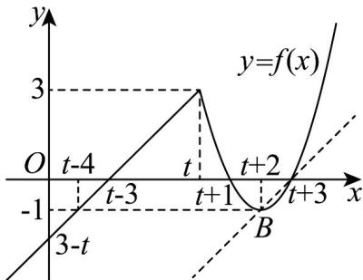

> [!faq]- 《专题06_函数基本性质高频题型精准突破_八大题型__高效培优期末专项训》官方解析
>
> > [!success]- **【答案】** $\left(\frac{25}{4},+\infty\right)$
>
> > [!note]- **【分析】**
> > 根据分段函数解析式分析函数性质，并画出 $f(x)$ 大致图象，随 $t$ 变化， $f(x)$ 的图象只在 $x$ 轴上平移，结合题设条件 $a > 6$ ，只需保证 $x \in (t - 4, t - 3)$ ， $x + a \in (t + 2, t + 3)$ 时有 $(x + a - t - 2)^2 - 1 > x - t + 3$ ，即可求参数范围·
>
> > [!note]- **【解析】**
> > 由 $y = x - t + 3$ 在 $x \in (-\infty, t)$ 上单调递增，且过点 $(t - 4, -1)$
> >
> > 在 $x \in [t, +\infty)$ 上 $y = (x - t - 2)^2 - 1$ ，在 $[t, t + 2)$ 上单调递减，在 $(t + 2, +\infty)$ 上单调递增，
> >
> > 结合 $f(x)$ 解析式，其大致图象如下图，
> >
> > 
> >
> > 随 $t$ 变化， $f(x)$ 的图象只在 $x$ 轴上平移，
> >
> > 令过 $B(t + 2, - 1)$ 且平行于 $y = x - t + 3$ 的直线为 $y = x + m$
> >
> > 则 $t + 2 + m = -1$ ，所以 $m = -3 - t$ ，故 $y = x - t - 3$
> >
> > 联立 $y = x - t - 3$ 与 $y = (x - t - 2)^2 -1$ ，消去 $y$ 得 $x - t - 2 = (x - t - 2)^2$
> >
> > 所以 $x = t + 2$ 或 $x = t + 3$
> >
> > 对任意 $x \in \mathbf{R}$ ， $t \in \mathbf{R}$ 都有 $f(x + a) > f(x)$ 成立，
> >
> > 由图知，在 $(t - 4, t + 2)$ 上 $f(x)$ 不单调，必有 $a > 6$
> >
> > 需保证 $x \in (t - 4, t - 3)$ ， $x + a \in (t + 2, t + 3)$ 时有 $\left(x + a - t - 2\right)^2 - 1 > x - t + 3$
> >
> > 所以 $x^{2} + (2a - 2t - 5)x + a^{2} - 2ta + t^{2} - 4a + 5t > 0$
> >
> > $\Delta = (2a - 2t - 5)^{2} - 4(a^{2} - 2ta + t^{2} - 4a + 5t) < 0$ ，整理得 $4a > 25$ ，所以 $a > \frac{25}{4}$
> >
> > 综上，实数 $a$ 的取值范围是 $\left(\frac{25}{4}, +\infty\right)$ .
> >
> > 故答案为： $\left(\frac{25}{4},+\infty\right)$
