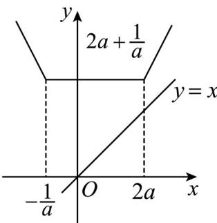

> [!faq]- 《专题06_函数基本性质高频题型精准突破_八大题型__高效培优期末专项训》官方解析
>
> > [!success]- **【答案】** AC
>
> > [!note]- **【分析】**
> > 先去绝对值，转化为分段函数，利用图像来解·
>
> > [!note]- **【解析】**
> > 当 $x \leq -\frac{1}{a}$ 时， $f(x) = -2x - \frac{1}{a} + 2a$ ；
> >
> > 当 $-\frac{1}{a} < x < 2a$ 时， $f(x) = \frac{1}{a} + 2a$ ；
> >
> > 当 $x$ 2a时， $f(x) = 2x + \frac{1}{a} - 2a$
> >
> > 函数图像如下图
> >
> > 
> >
> > 当 $-\frac{1}{a} < x < 2a$ 时，函数 $f(x) = \left|x + \frac{1}{a}\right| + |x - 2a|$ 取最小值，即 $f(x)_{\min} = 2a + \frac{1}{a} \cdot 2\sqrt{2}$ 当且仅当 $a = \frac{\sqrt{2}}{2}$ 时取等号，故 $f(x) = 2\sqrt{2}$ ，A 正确.
> >
> > 故函数对称轴为 $x=\frac{-\frac{1}{a}+2a}{2}=a-\frac{1}{2a}$ ，B 错误.
> >
> > 当 $x = 2a$ 时， $y = x = 2a$ ，且 $a > 0$ ，所以 $2a + \frac{1}{a} > 2a$ ，所以 $f(x)$ 图像在直线 $y = x$ 的上方， $^{\mathrm{C}}$ 正确。当 $3 < 2a$ 时，即 $a > \frac{3}{2}$ 时， $f(3) = \frac{1}{a} + 2a < 5$ ，解得 $\frac{5 - \sqrt{17}}{4} < a < \frac{5 + \sqrt{17}}{4}$ ，故 $\frac{3}{2} < a < \frac{5 + \sqrt{17}}{4}$ 当 $3 - 2a$ 时，即 $0 < a \leq \frac{3}{2}$ 时， $f(3) = 6 + \frac{1}{a} - 2a < 5$ ，解得 $a > 1$ 或 $a < -\frac{1}{2}$ ，故 $1 < a \leq \frac{3}{2}$ ；
> >
> > 综上 $1 < a < \frac{5 + \sqrt{17}}{4}$ ，D错误.
> >
> > 故选 **AC**
