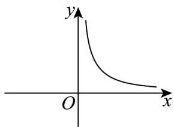
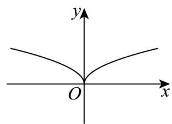
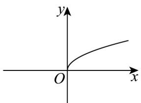

> [!faq]- 《专题08_对数与对数函数高频题型精准突破_八大题型__高效培优期末专项》官方解析
>
> > [!success]- **【答案】**  B  C 
>
> > [!note]- **【分析】**
> > 根据对数型函数恒过定点求出 $P(16,4)$ ，代入幂函数解析式得 $y = x^{\frac{1}{2}} = \sqrt{x}$ ，进而可得图象。【详解】因为 $y = \log_a(x - 15) + 4(a > 0, a \neq 1)$ ，当 $x = 16$ 时， $y = 4$ ，所以过定点 $P(16,4)$ ，设幂函数 $y = x^\alpha$ ，幂函数的图象经过点 $P$ ，代入 $P(16,4)$ ，即 $4 = 16^\alpha$ ，解得 $\alpha = \frac{1}{2}$ ，所以幂函数为 $y = x^{\frac{1}{2}} = \sqrt{x}$ ，定义域 $\{x | x^3, 0\}$ ，结合定义域和图象，可知 C 正确，故选：C.
> >
> > 28. 函数 $f(x) = \log_a (x - 1) - a^{x-2} + 4$ （ $a > 0$ 且 $a \neq 1$ ）的图象必过定点 \_\_\_\_.
> >
> > 【答案】(2,3)
> >
> > 【分析】根据 $\log_{a}1=0$ ， $a^{0}=1$ 即可得到定点.
>
> > [!note]- **【解析】**
> > 由 $\log_{a}1=0,\quad a^{0}=1$
> >
> > 所以当 x=2 时， $f(2)=\log_{a}(2-1)-a^{2-2}+4=0-1+4=3$
> >
> > 所以函数 $f(x)$ 过定点 $(2,3)$ .
> >
> > 故答案为： $(2,3)$ .
> >
> > 29. 函数 $y = \log_a(2x - 3) + 2$ ( $a > 0$ 且 $a \neq 1$ ) 的图象所过定点的坐标为 ( )
> >
> > 【答案】
> >
> > A. (2,2)
> >
> > B. (0,2)
> >
> > C. (1,2)
> >
> > D. (2,0)
> >
> > 【答案】A
> >
> > 【分析】令 $2x - 3 = 1$ 即可求得定点坐标·
> >
> > 【详解】令 2x - 3 = 1 ，得 x = 2 ，此时 y = 2 ，故定点坐标为 $(2, 2)$ .
> >
> > 故选 **A**
