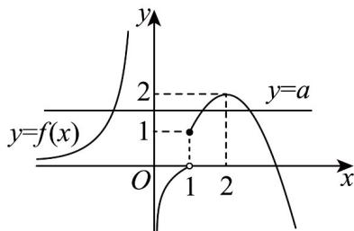

> [!faq]- 《专题10_二分法与函数零点方程高频题型精准突破_八大题型__高效培优期》官方解析
>
> > [!success]- **【答案】** A. -1 B. 0 C. 1 D. 2
>
> > [!note]- **【分析】**
> > 根据二次函数、幂函数、对数函数的图象特点画出函数 $f(x)$ ，结合数形结合思想进行求解即可。
>
> > [!note]- **【解析】**
> > 当 $x \in (-\infty, 0)$ 时， $f(x) = 2x^{-2}$ 单调递增，且 $f(x) = 2x^{-2}$ 的值域为 $(0, +\infty)$ ；
> > 当 $x \in (0,1)$ 时， $f(x) = \frac{1}{2} \ln x$ 单调递增，所以 $f(x) = \frac{1}{2} \ln x < 0$ ，即值域为 $(-\infty, 0)$ ；
> > 当 $x \in [1, +\infty)$ ， $f(x) = -x^2 + 4x - 2 = -(x - 2)^2 + 2$ ，当 $x = 2$ 时，取得最大值 $^2$ ，故值域为 $(-\infty, 2]$ 且 $f(1) = 1$ 画出函数图象如图所示：
> >
> > 
> >
> > 要想 $g(x)=f(x)-a$ 有两个零点，
> >
> > 则 $f(x)$ 的图象与直线 $y = a$ 有两个交点，则 $a < 0$ 或 $0 < a < 1$ 或 $a = 2$ ，
> >
> > 所以 AD 正确·
> >
> > 故选 **AD**.
