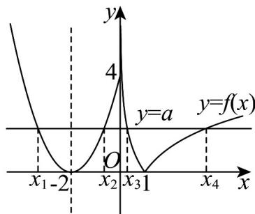

> [!faq]- 《专题10_二分法与函数零点方程高频题型精准突破_八大题型__高效培优期》官方解析
>
> > [!success]- **【答案】** -63
>
> > [!note]- **【分析】**
> > 根据 $f(x)$ 的解析式，作出 $f(x)$ 的图象，由题意得 $y = f(x)$ 图象与 y = a 图象有四个不同的交点 $x_{1}, x_{2}, x_{3}, x_{4}$ ，根据二次函数的对称性，可得 $x_{1} + x_{2} = -4$ ，根据对数的性质，可得 $x_{3}x_{4} = 1$ ，分析可得 $x_{4}$ 的范围，代入所求，化简整理，即可得答案.
>
> > [!note]- **【解析】**
> > 当 $x \leq 0$ 时， $f(x) = (x + 2)^2$ 为开口向上，对称轴为 $x = -2$ 的抛物线，
> >
> > 所以 $f(x)$ 在 $(- \infty, -2)$ 上单调递减，在 $[-2, 0]$ 上单调递增，
> >
> > 当 $0 < x < 1$ 时， $f(x) = -\log_2 x$ ，单调递减，
> >
> > 当 $x$ 1时， $f(x) = \log_2 x$ ，单调递增，
> >
> > 因为 $f(x) = a$ 有四个不同的解 $x_{1}, x_{2}, x_{3}, x_{4}$
> >
> > 所以 $y = f(x)$ 图象与 y = a 图象有四个不同的交点 $x_{1}, x_{2}, x_{3}, x_{4}$ ，如图所示
> >
> > 
> >
> > 根据二次函数的对称性可得 $\frac{x_1 + x_2}{2} = -2$ ，即 $x_{1} + x_{2} = -4$
> >
> > 又 $\log_2x_3 = -a,\log_2x_4 = a$
> >
> > 所以 $\log_2x_3 + \log_2x_4 = \log_2x_3x_4 = 0$ ，解得 $x_{3}x_{4} = 1$
> >
> > 又 $f(0) = (0 + 2)^{2} = 4$ ，所以 $0 < a \leq 4$
> >
> > 当 $a = 4$ 时， $\log_2x_4 = 4$ ，解得 $x_{4} = 16$ ，所以 $1 <   x_{4}\leq 16$
> >
> > 则所求 $x_{4}(x_{1} + x_{2}) + \frac{16}{x_{3}x_{4}^{2}} = -4x_{4} + \frac{16}{x_{4}}$
> >
> > 因为 $y = -4x_{4} + \frac{16}{x_{4}}$ 在 $(1,16]$ 单调递减，则最小值为 $-4\times 16 + \frac{16}{16} = -63$
> >
> > 所以 $x_{4}(x_{1}+x_{2})+\frac{16}{x_{3}x_{4}^{2}}$ 的最小值为 -63.
> >
> > 故答案为：-63
