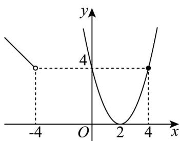
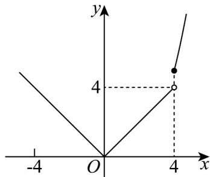
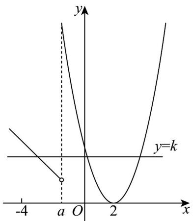
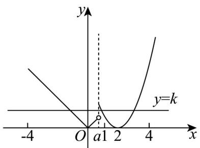
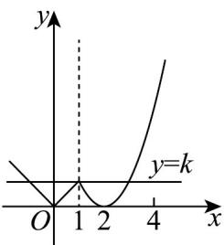
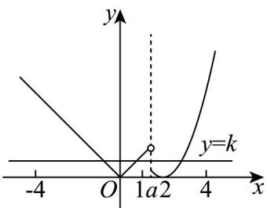
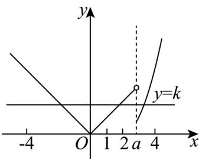

> [!faq]- 《专题10_二分法与函数零点方程高频题型精准突破_八大题型__高效培优期》官方解析
>
> > [!success]- **【答案】** (-4,4)
>
> > [!note]- **【分析】**
> > 对 a 的取值和区间的相对位置进行分类讨论，数形结合，即可求得结果·
>
> > [!note]- **【解析】**
> > 当 $a \leq -4$ 时，由 $f(x)$ 的图象知， $f(x) = k$ 在 $[-4, 4]$ 上最多有两个实数解，不满足题意；
> >
> > 
> >
> > 当 $a = 4$ 时，由 $f(x)$ 的图象可知，不存在实数 $k$ 使得 $f(x) = k$ 在 $[-4, 4]$ 上有三个实数解，不满足题意；
> >
> > 
> >
> > 若 $-4 < a < 4$ ，如下图，均可找到实数 $k$ ，使得 $f(x) = k$ 在 $[-4, 4]$ 上有三个实数解，
> >
> > 
> >
> > 
> >
> > 
> >
> > 
> >
> > 
> >
> > 所以实数 a 的取值范围是 $(-4,4)$ .
> >
> > 故选： $(-4,4)$
