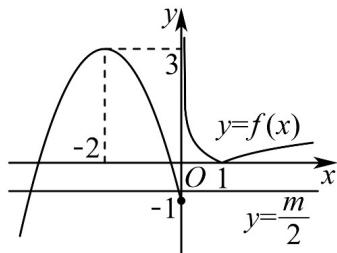

> [!faq]- 《专题10_二分法与函数零点方程高频题型精准突破_八大题型__高效培优期》官方解析
>
> > [!success]- **【答案】** $-2 \leq m < 0$ 或 $m > 6$
>
> > [!note]- **【分析】**
> > 首先由方程 $g(x) = 0$ ，求得 $f(x) = 3$ 或 $f(x) = \frac{m}{2}$ ，再画出函数 $f(x)$ 的图象，再利用数形结合求实数 $m$ 的取值范围，即可求解·
>
> > [!note]- **【解析】**
> > 令 $g(x)=2f^{2}(x)-(m+6)f(x)+3m=\left[2f(x)-m\right]\left[f(x)-3\right]=0$
> >
> > 所以 $f(x) = 3$ 或 $f(x) = \frac{m}{2}$ ，如图，画出函数 $f(x)$ 的大致图象，
> >
> > 
> >
> > 时，与的图象有 $^{3}$ 个交点，
> >
> > $$
> > y = f (x)
> > $$
> >
> > 所以 $y = \frac{m}{2}$ 与 $y = f(x)$ 的图象只能有 2 个交点，则 $-1 \leq \frac{m}{2} < 0$ 或 $\frac{m}{2} > 3$
> >
> > 所以 $-2 \leq m < 0$ 或 m > 6.
> >
> > 故答案为： $-2\leq m <   0$ 或 $m > 6$
