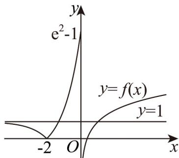

> [!faq]- 《专题10_二分法与函数零点方程高频题型精准突破_八大题型__高效培优期》官方解析
>
> > [!success]- **【答案】** C
>
> > [!note]- **【分析】**
> > 设 $f(x) = t$ ，则方程 $1 - m^2 + 2mf(x) = [f(x)]^2$ 转化为 $t$ 的一元二次方程，解出这个 $t$ 的一元二次方程的解，画出 $f(x) = \begin{cases} 1 + \ln x, & x > 0 \\ |e^{x+2} - 1|, & x \leq 0 \end{cases}$ 的图象，通过图象数形结合得到的取值范围·
>
> > [!note]- **【解析】**
> > 令 $f(x) = t$ ，有 $1 - m^2 + 2mt = t^2$ ，即 $[t - (m - 1)][t - (m + 1)] = 0$
> >
> > 解得 $t_1 = m - 1$ 或 $t_2 = m + 1$
> >
> > 作出 $f(x)$ 的图象，如图，
> >
> > ∵ 方程 $1 - m^{2} + 2mf(x) = \left[f(x)\right]^{2}$ 有且仅有 5 个不同实数根，
> >
> > 则由图得 $\left\{ \begin{array}{l} 0 < m - 1 < 1 \\ 1 \leq m + 1 \leq e^2 - 1 \end{array} \right.$ 或 $\left\{ \begin{array}{l} m - 1 = 0 \\ 0 < m + 1 < 1 \end{array} \right.$ ，
> >
> > 解得 $\left\{ \begin{array}{l} 1 < m < 2 \\ 0 \leq m \leq e^2 - 2 \end{array} \right.$ 或 $\left\{ \begin{array}{l} m = 1 \\ -1 < m < 0 \end{array} \right.$ ，
> >
> > 则 $1 < m < 2$
> >
> > 故选：C.
> >
> > 
