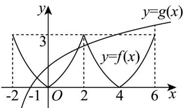

> [!faq]- 《专题10_二分法与函数零点方程高频题型精准突破_八大题型__高效培优期》官方解析
>
> > [!success]- **【答案】** B
>
> > [!note]- **【分析】**
> > 由题可得 $f(x)$ 的一个周期为 $^{4}$ ，据此可得 $f(x)$ 在 $[-2,6]$ 上的大致图像， $f(x) - \log_a (x + 2) = 0 (a > 1)$ 恰有三个不同的实数根，等价于 $f(x)$ 在 $[-2,6]$ 上的大致图像与函数 $y = \log_a (x + 2)$ 在 $[-2,6]$ 上的大致图像有三个不同交点，据此可得答案·
>
> > [!note]- **【解析】**
> > 因 $f(x)=f(x+4)$ ，则 $f(x)$ 的一个周期为 4.
> >
> > 因 $x \in [-2, 0]$ 时， $f(x) = \left(\frac{1}{2}\right)^x - 1$ ，又 $f(x)$ 是定义在 $\mathbf{R}$ 上的偶函数，则 $f(x) = f(-x) = \left(\frac{1}{2}\right)^{-x} - 1$ ，结合一个周期为 $4$ ，可得 $f(x)$ 大致图像如下。
> >
> > 注意到 $f(x) - \log_a(x + 2) = 0(a > 1)$ 恰有三个不同的实数根等价于 $f(x)$ 在 $[-2,6]$ 上的大致图像与函数 $g(x) = \log_a(x + 2)$ 在 $[-2,6]$ 上的大致图像有三个不同交点，则由图可得：
> >
> > $$
> > \left\{ \begin{array}{l} f (2) > g (2) \\ g (6) > f (6) \end{array} \Rightarrow \left\{ \begin{array}{l} 3 > \log_ {a} 4 \\ \log_ {a} 8 > 3 \end{array} \Rightarrow \left\{ \begin{array}{l} \log_ {a} a ^ {3} > \log_ {a} 4 \\ \log_ {a} 8 > \log_ {a} a ^ {3} \end{array} \Rightarrow \sqrt [ 3 ]{4} <   a <   2. \right. \right. \right.
> > $$
> >
> > 故答案为：B
> >
> > 
