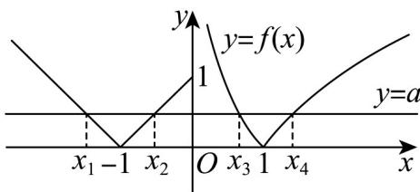

> [!faq]- 《专题10_二分法与函数零点方程高频题型精准突破_八大题型__高效培优期》官方解析
>
> > [!success]- **【答案】** $\left(-2,-2+e-\frac{1}{e}\right]$
>
> > [!note]- **【分析】**
> > 作出函数的图象可得： $x_{1} + x_{2} = -2$ ， $x_{4} = \frac{1}{x_{3}}$ ，进而得到 $x_{1} + x_{2} + \frac{1}{x_{3}} -\frac{1}{x_{4}} = -2 + \frac{1}{x_3} -x_3$ ，求出 $x_{3}$ 的取值范围，利用函数的单调性进而求解·
>
> > [!note]- **【解析】**
> > 如下图所示：
> >
> > 
> >
> > 方程 $f(x) = a$ 有四个不同的解 $x_{1}$ 、 $x_{2}$ 、 $x_{3}$ 、 $x_{4}$ 且 $x_{1} < x_{2} < x_{3} < x_{4}$ ，且 $0 < a \leq 1$ ，
> >
> > 由图可知，点 $(x_{1},a)$ 、 $(x_{2},a)$ 关于直线 $x = -1$ 对称，则 $x_{1} + x_{2} = -2$
> >
> > 由图可得 $0 < x_{3} < 1 < x_{4}$ ，由 $\left|\ln x_3\right| = \left|\ln x_4\right|$ 可得 $\ln x_4 = -\ln x_3 = \ln \frac{1}{x_3}$ ，可得 $x_4 = \frac{1}{x_3}$ ，
> >
> > 由 $a = \left|\ln x_3\right| = -\ln x_3\in (0,1]$ 可得 $\frac{1}{\mathsf{e}}\leq x_3 < 1$
> >
> > 所以， $x_{1} + x_{2} + \frac{1}{x_{3}} -\frac{1}{x_{4}} = \frac{1}{x_{3}} -x_{3} - 2$
> >
> > 因为函数 $y = \frac{1}{x}$ 、 $y = -x - 2$ 在 $\left[\frac{1}{\mathrm{e}}, 1\right)$ 上均为减函数，故函数 $y = \frac{1}{x} - x - 2$ 在 $\left[\frac{1}{\mathrm{e}}, 1\right)$ 上为减函数，因为 $\frac{1}{\mathrm{e}} \leq x_3 < 1$ ，则 $-2 < \frac{1}{x_3} - x_3 - 2 \leq -2 + \mathrm{e} - \frac{1}{\mathrm{e}}$ ，
> >
> > 因此， $x_{1} + x_{2} + \frac{1}{x_{3}} -\frac{1}{x_{4}}$ 的取值范围是 $\left(-2, - 2 + \mathrm{e} - \frac{1}{\mathrm{e}}\right]$
> >
> > 故答案为： $\left(-2,-2+e-\frac{1}{e}\right]$ .
>
> > [!tip]- **【名师点睛】**
> > 关键点点睛：解决本题的关键在于根据函数的对称性、对数的运算性质将所求代数式化简，转化为只含一个变量的函数，结合函数基本性质求解·
