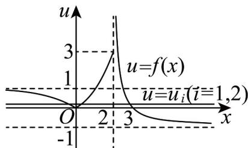

> [!faq]- 《专题10_二分法与函数零点方程高频题型精准突破_八大题型__高效培优期》官方解析
>
> > [!success]- **【答案】** C
>
> > [!note]- **【分析】**
> > 令 $u = f(x)$ ，可得出 $u^2 + 3au + a + 2 = 0$ ，令 $g(u) = u^2 + 3au + a + 2$ ，设函数 $g(u)$ 的两个零点分别为 $u = u_1$ 、 $u = u_2$ ，分三种情况讨论：（i） $u_1 = 0$ ， $0 < u_2 < 1$ ；（ii） $0 < u_1 < 1$ ， $u_2 = 1$ ；（iii） $0 < u_1 < 1$ ， $1 < u_2 \leq 3$ 。前两种情况直接求出 $a$ 的值，检验即可，在第三种情况中，根据二次函数的零点分布可得出关于实数 $a$ 的不等式组，由此可解得实数 $a$ 的取值范围。
>
> > [!note]- **【解析】**
> > 当 x > 2 时， $f(x) = \frac{3 - x}{x - 2} = \frac{1 - (x - 2)}{x - 2} = \frac{1}{x - 2} - 1$ ，
> >
> > 设 $u = f(x)$ ，则 $u^2 + 3au + a + 2 = 0$ ，令 $g(u) = u^2 + 3au + a + 2$
> >
> > 设函数 $g(u)$ 的两个零点分别为 $u = u_{1}$ 、 $u = u_{2}$ ，
> >
> > 作出函数 $u = f(x)$ 的图象如下图所示：
> >
> > 
> >
> > 由图可知，直线 $u = u_{i} (i = 1, 2)$ 与函数 $u = f(x)$ 的图象交点个数为 0、1、2、3，
> >
> > 因为关于 x 的方程 $f^{2}(x)+3af(x)+a+2=0$ 只有 5 个不相等的实数根，分以下几种情况讨论：
> >
> > (i) $u_{1} = 0$ ， $0 < u_{2} < 1$ ，则 $g(0) = a + 2 = 0$ ，可得 $a = -2$
> >
> > 则关于 u 的方程为 $u^{2}-6u=0$ ，解得 $u_{1}=0$ ， $u_{2}=6$ ，不合乎题意；
> >
> > (ii) $0 < u_{1} < 1$ ， $u_{2} = 1$ ，则 $g(1) = 4a + 3 = 0$ ，解得 $a = -\frac{3}{4}$
> >
> > 由韦达定理可得 $u_{1} + u_{2} = u_{1} + 1 = -3a = \frac{9}{4}$ ，解得 $u_{1} = \frac{5}{4}$ ，不合乎题意；
> >
> > (iii) 0 < u₁ < 1, 1 < u₂ ≤ 3，由二次函数的零点分布可得 $\left\{ \begin{array}{ll}g(0) = a + 2 > 0\\ g(1) = 4a + 3 < 0\\ g(3) = 11 + 10a - 0 \end{array} \right.$
> >
> > 解得 $-\frac{11}{10} \leq a < -\frac{3}{4}$ .
> >
> > 综上所述，实数 $a$ 的取值范围是 $\left[-\frac{11}{10}, -\frac{3}{4}\right)$
> >
> > 故选 **C**.
