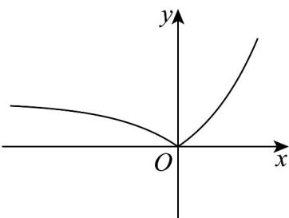

> [!faq]- 《专题10_二分法与函数零点方程高频题型精准突破_八大题型__高效培优期》官方解析
>
> > [!success]- **【答案】** A
>
> > [!note]- **【分析】**
> > 换元法令 $t = \left|2^{x} - 1\right| \neq 0$ ，将方程的根问题转化为方程 $t^2 - (2 + 3k)t + 1 + 2k = 0$ 有 2 个不等实根，数形结合，根据一元二次方程根的分布列出不等式求解即可·
>
> > [!note]- **【解析】**
> > 令 $t = \left|2^{x} - 1\right|\neq 0$ ，其函数图象如图：
> >
> > 
> >
> > 方程 $g\left(\left|2^{x} - 1\right|\right) + \frac{2k}{\left|2^{x} - 1\right|} -3k = 0$ 可化为 $g(t) + \frac{2k}{t} -3k = 0$
> >
> > 即 $t + \frac{1}{t} - 2 + \frac{2k}{t} - 3k = 0$ ，即 $t^2 - (2 + 3k)t + 1 + 2k = 0 (t \neq 0)$ ，
> >
> > 则该方程有 $^{2}$ 个不等的实根 $t_{1}, t_{2}$
> >
> > 设 $t_1 < t_2$ ，则 $0 < t_1 < 1, t_2 = 1$
> >
> > 令 $h(t) = t^2 - (2 + 3k)t + 1 + 2k$
> >
> > 则 $\left\{ \begin{array}{l}h(0) = 2k + 1 > 0\\ h(1) = -k = 0 \end{array} \right.$ 或 $\left\{ \begin{array}{l}h(0) = 2k + 1 > 0\\ h(1) = -k = 0 \end{array} \right.$ $\frac{1}{2} <  \frac{2 + 3k}{2} <  1$
> >
> > 解得 $k > 0$ 或无解，
> >
> > 所以实数 k 的取值范围是 $(0, +\infty)$ .
> >
> > 故选 **A**·
