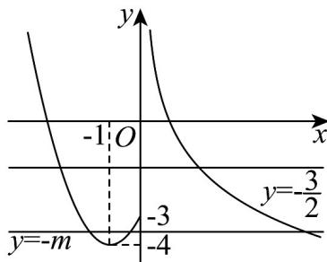

> [!faq]- 《专题10_二分法与函数零点方程高频题型精准突破_八大题型__高效培优期》官方解析
>
> > [!success]- **【答案】** $(-4,-3]$
>
> > [!note]- **【分析】**
> > 令 $t = f(x)$ ，即 $t^2 + \left(\frac{3}{2} - m\right)t - \frac{3}{2}m = 0$ 得 $(t - m)\left(t + \frac{3}{2}\right) = 0$ ，解得 $t = m$ 或 $-\frac{3}{2}$ ，作出函数 $f(x)$ 的图像，利用数形结合即可求解。
>
> > [!note]- **【解析】**
> > 令 $t = f(x)$ ，则有 $t^2 + \left(\frac{3}{2} - m\right)t - \frac{3}{2}m = 0$ ，即 $(t - m)\left(t + \frac{3}{2}\right) = 0$ ，所以 $t = m$ 或 $-\frac{3}{2}$ ，
> >
> > 作出函数 $f(x)$ 的图像：
> >
> > 
> >
> > 当 $t = -\frac{3}{2}$ 时， $f(x)$ 与 $y = -\frac{3}{2}$ 有两个不同的交点，
> >
> > 即只需 y = m 与 $f(x)$ 有 3 个不同的交点即可，
> >
> > 由图可知： $-4 < m \leq -3$ ，所以 $m \in (-4, -3]$
> >
> > 故答案为： $(-4,-3]$ .
