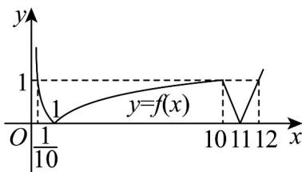

> [!faq]- 《专题10_二分法与函数零点方程高频题型精准突破_八大题型__高效培优期》官方解析
>
> > [!success]- **【答案】** ABD
>
> > [!note]- **【分析】**
> > 根据解析式及对数函数性质画出函数大致图象并确定函数的相关性质，进而得 $x_{1}x_{2} = 1$ 且 $x_{3} + x_{4} = 22$ ， $\frac{1}{10} < x_1 < 1 < x_2 < 10 < x_3 < 11 < x_4 < 12$ ，进而判断各项的正误·
>
> > [!note]- **【解析】**
> > 由解析式，在 $(0,1)$ ， $(10,11)$ 上单调递减，在 $(1,10)$ ， $(11,+\infty)$ 上单调递增， $f(\frac{1}{10})=f(10)=f(12)=1$ ， $f(1)=f(11)=0$ ，可得函数大致图象如下，
> >
> > 
> >
> > 由 $0 < x_{1} < x_{2} < x_{3} < x_{4}$ ，且 $f(x_{1}) = f(x_{2}) = f(x_{3}) = f(x_{4})$ ，则 $\frac{1}{10} < x_1 < 1 < x_2 < 10 < x_3 < 11 < x_4 < 12$
> >
> > 所以 $\lg x_{1} = -\lg x_{2}$ ，易知 $x_{1}x_{2} = 1$ ，且 $x_{3} + x_{4} = 22$ ，
> >
> > 所以 $x_{1} + x_{2} = x_{1} + \frac{1}{x_{1}} \in (2, \frac{101}{10})$ ， $x_{3}x_{4} = x_{3}(22 - x_{3}) \in (120, 121)$ ，
> >
> > 综上， $x_{1}+x_{2}+x_{3}+x_{4}\in(24,32\frac{1}{10})$ .
> >
> > 故选：ABD
> >
> > 51. 函数 $f(x) = \mathrm{e}^{x} + \mathrm{e}^{2 - x} + |x - 1| - 2025$ 所有零点之和为 \_\_\_\_.
> >
> > 【答案】2
> >
> > 【分析】分析函数 $f(x)$ 的对称性和单调性，再求出所有零点和
> >
> > 【详解】函数 $f(x)$ 的定义域为 $R$ ， $f(2 - x) = e^{2 - x} + e^x + |1 - x| - 2025 = f(x)$ ，
> >
> > 函数 $f(x)$ 的图象关于直线 $x = 1$ ，当 $x = 1$ 时， $f(x) = \mathrm{e}^x + \mathrm{e}^{2 - x} + x - 2026$ ，
> >
> > 令 $g(x)=\mathrm{e}^{x}+\mathrm{e}^{2-x},x$ 1，任取 $x_{1},x_{2}\in[1,+\infty),x_{1}<x_{2}$
> >
> > $$
> > g \left(x _ {1}\right) - g \left(x _ {2}\right) = \mathrm{e} ^ {x _ {1}} + \mathrm{e} ^ {2 - x _ {1}} - \mathrm{e} ^ {x _ {2}} - \mathrm{e} ^ {2 - x _ {2}} = \left(\mathrm{e} ^ {x _ {1}} - \mathrm{e} ^ {x _ {2}}\right) \left(1 - \frac {\mathrm{e} ^ {2}}{\mathrm{e} ^ {x _ {1}} \mathrm{e} ^ {x _ {2}}}\right),
> > $$
> >
> > 由 $1 \leq x_{1} < x_{2}$ ，得 $\mathrm{e} \leq \mathrm{e}^{x_{1}} < \mathrm{e}^{x_{2}}$ ，则 $\mathrm{e}^{x_{1}} - \mathrm{e}^{x_{2}} < 0, 1 - \frac{\mathrm{e}^{2}}{\mathrm{e}^{x_{1}}\mathrm{e}^{x_{2}}} > 0$ ， $g(x_{1}) < g(x_{2})$ ，
> >
> > 因此函数 $g(x)$ 在 $[1,+\infty)$ 上单调递增，而函数 y=x-2026 在 $[1,+\infty)$ 上单调递增，则函数 $f(x)$ 在 $[1,+\infty)$ 上单调递增， $f(1)=2\mathrm{e}-2025<0,f(2025)>0$
> >
> > 于是函数 $f(x)$ 在 $[1, +\infty)$ 上有唯一零点，由对称性知，函数 $f(x)$ 在 $(- \infty, 1]$ 上有唯一零点，
> >
> > 所以函数 $f(x)$ 所有零点之和为 2.
> >
> > 故答案为：2
