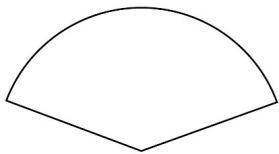

> [!faq]- 《专题11_任意角与弧度制高频题型精准突破_八大题型__高效培优期末专项》官方解析
>
> > [!success]- **【答案】** $7\pi$
>
> > [!note]- **【分析】**
> > 利用角度与弧度的互化公式把角度化成弧度即可·
>
> > [!note]- **【解析】**
> > 因为 $1260^{\circ} = 1260 \times \frac{\pi}{180} = 7\pi$
> >
> > 故答案为： $7\pi$
> >
> > 32．折扇在中国已有三千多年的历史，“扇”与“善”谐音，折扇也寓意“善良”“善行”·它常以字画的形式体现我国的传统文化(如图1)，也是“运筹帷幄”“决胜千里”“大智大勇”的象征，图2为其结构简化图·若在圆形纸张上剪下一把扇形的扇子(扇形的半径和圆形纸张的半径相同)，记该扇形的面积为 $S_{1}$ ，剩下的图形面积为 $S_{2}$ 若 $S_{1}$ 与 $S_{2}$ 的比值满足黄金分割值 $\frac{\sqrt{5}-1}{2}$ ，则扇子的圆心角大约为（）（参考数据： $\sqrt{5}\approx2.236$ ）
> >
> > 
> > 图1
> >
> > 
> > 图2
> >
> > A. $222^{\circ}$ B. $146^{\circ}$ C. $138^{\circ}$ D. $111^{\circ}$
> >
> > 【答案】C
> >
> > 【分析】设扇形的圆心角为 $\alpha$ ，半径为 $r$ ，利用扇形及圆的面积公式化简求解.
> >
> > 【详解】设扇形的圆心角为 $\alpha$ ，半径为 $r$ ，则 $S_{1} = \frac{1}{2}\alpha r^{2}$ ， $S_{2} = \pi r^{2} - \frac{1}{2}\alpha r^{2}$
> >
> > 所以 $\frac{S_1}{S_2} = \frac{\frac{1}{2}\alpha r^2}{\pi r^2 - \frac{1}{2}\alpha r^2} = \frac{\sqrt{5} - 1}{2}$ ，解得 $\alpha = \frac{2(\sqrt{5} - 1)}{\sqrt{5} + 1}\pi = (3 - \sqrt{5})\pi \approx 138^\circ$
> >
> > 故选 **C**
