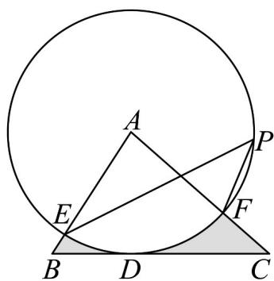

<!-- question-source:start -->
41. 如图，在 $\Delta ABC$ 中， $BC = 4$ ，以点 $A$ 为圆心，2为半径 $\odot A$ 的与 $BC$ 相切于点 $D$ ，交 $AB$ 于 $E$ ，交 $AC$ 于 $F$ ，点 $P$ 是 $\odot A$ 上的一点，且 $\angle EPF = 40^{\circ}$ ，则图中阴影部分的面积是 \_\_。（结果保留 $\pi$ ）

<!-- question-source:end -->

![[高中/课堂同步/题库/人教A版高中数学同步讲义(2026)/01_必修第一册/期末/专项训练/专题11_任意角与弧度制高频题型精准突破_八大题型__高效培优期末专项/考点06_扇形面积的计算_sec_08/questions/answers/Q00067210A1.md]]
