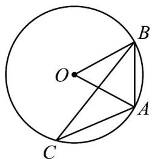

<!-- question-source:start -->
55. 如图，点 $A, B, C$ 是圆 $O$ 上的点。

(1)若 $\angle ACB = \frac{\pi}{6}$ ， $AB = 4\mathrm{cm}$ ，求扇形 $AOB$ 的面积和弧 $AB$ 的长；

(2)若扇形 $AOB$ 的面积为 $10\mathrm{cm}^2$ ，求扇形 $AOB$ 周长的最小值，并求出此时 $\angle AOB$ 的值.
<!-- question-source:end -->

![[高中/课堂同步/题库/人教A版高中数学同步讲义(2026)/01_必修第一册/期末/专项训练/专题11_任意角与弧度制高频题型精准突破_八大题型__高效培优期末专项/考点06_扇形面积的计算_sec_08/questions/answers/Q00067222A1.md]]
