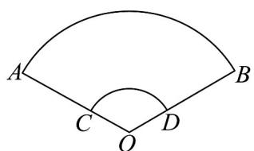

> [!faq]- 《专题11_任意角与弧度制高频题型精准突破_八大题型__高效培优期末专项》官方解析
>
> > [!success]- **【答案】**  A. $72\mathrm{cm}^2$ B. $144\pi \mathrm{cm}^2$ C. $\frac{144}{3}\pi \mathrm{cm}^2$ D. $180\pi \mathrm{cm}^2$
>
> > [!note]- **【分析】**
> > 利用弧长公式和扇形面积公式即可得到答案.
>
> > [!note]- **【解析】**
> > 作出示意图如图所示：由题意可得 $AO=\frac{16\pi}{\frac{2\pi}{3}}=24$ ， $CO=\frac{8\pi}{\frac{2\pi}{3}}=12$ ，
> > 扇形 AOB 的面积是 $\frac{1}{2} \times \frac{2\pi}{3} \times 24^{2} = 192\pi$ 扇形 COD 的面积是 $\frac{1}{2} \times \frac{2\pi}{3} \times 12^{2} = 48\pi$ .
> > 则扇面（曲边四边形 ABDC）的面积是 $192\pi - 48\pi = 144\pi$ .
> >
> > 故选：B.
> >
> > 
> >
> > 考点07 扇形中的最值问题
