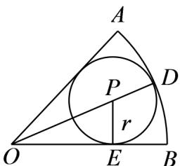

> [!faq]- 《专题11_任意角与弧度制高频题型精准突破_八大题型__高效培优期末专项》官方解析
>
> > [!success]- **【答案】** A. $5 - \frac{1}{\sin 1}$ B. $\frac{5\sin 1}{2 + 2\sin 1}$ C. $\frac{5\sin 1}{1 + \sin 1}$ D. $5 + \frac{5}{1 + \sin 1}$
>
> > [!note]- **【分析】**
> > 设出扇形半径和圆心角，根据周长得到方程，并表示出扇形面积，利用基本不等式求出最值，得到扇形的半径和圆心角，从而结合三角函数得到 $\frac{r}{\frac{5}{2} - r} = \sin 1$ ，求出答案· 【详解】设扇形的半径为 $R$ ，圆心角为 $\theta (\theta >0)$ ，则弧长 $l = \theta R$ 故 $2R + \theta R = 10$ ，则 $R = \frac{10}{2 + \theta}$ 故扇形面积为 $S = \frac{1}{2}\theta R^2 = \frac{1}{2}\theta \frac{100}{(2 + \theta)^2} = \frac{50}{\theta + \frac{4}{\theta} + 4}$
>
> > [!note]- **【解析】**
> > 由基本不等式得 $\theta +\frac{4}{\theta}$ $2\sqrt{\theta\cdot\frac{4}{\theta}} = 4$ ，当且仅当 $\theta = \frac{4}{\theta}$ ，即 $\theta = 2$ 时，等号成立，
> > 故 $S = \frac{50}{\theta + \frac{4}{\theta} + 4} \leq \frac{50}{4 + 4} = \frac{25}{4}$
> > 此时 $R=\frac{10}{2+\theta}=\frac{5}{2}$ ，
> > 由对称性可知 $\angle BOD = 1$ ，
> > 设内切圆的圆心为 $P$ ，因为 $DO = \frac{5}{2}$ ，故 $OP = \frac{5}{2} - r$
> > 过点 $P$ 作 $PE \perp OB$ 于点 $E$
> > 则 $PE = r$ ，在 Rt△ OEP 中， $\sin \angle BOD = \frac{PE}{OP}$ ，即 $\frac{r}{2} -r = \sin 1$
> > 解得 $r=\frac{5\sin1}{2+2\sin1}$ .
> > 
> >
> > 故选 **B**
