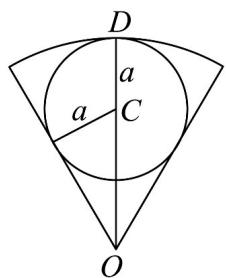

> [!faq]- 《专题11_任意角与弧度制高频题型精准突破_八大题型__高效培优期末专项》官方解析
>
> > [!success]- **【答案】** $2\pi$
>
> > [!note]- **【分析】**
> > 根据条件求出扇形半径 r，设割出的圆半径为 a，圆心为 C，由 $r = |CO| + a$ 求得 a，从而求得的周长.
>
> > [!note]- **【解析】**
> > 设扇形所在圆半径为 $r$ ， $\therefore \frac{1}{2} \cdot \frac{\pi}{3} r^2 = \frac{3\pi}{2}, \therefore r = 3$
> >
> > 
> >
> > 如图：设割出的圆半径为 $\quad a$ ，圆心为 $\quad C$ ，∴ $\left|CO\right|=\frac{a}{\sin\frac{\pi}{6}}=2a$
> >
> > $r = 3 = |CO| + |DC| = 3a$ ，故 $a = 1$
> >
> > 所以最大的圆周长为 $2\pi$ .
> >
> > 故答案为： $2\pi$
