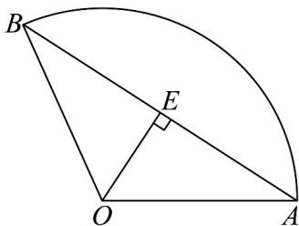

> [!faq]- 《专题11_任意角与弧度制高频题型精准突破_八大题型__高效培优期末专项》官方解析
>
> > [!success]- **【答案】** A
>
> > [!note]- **【分析】**
> > 设扇形的圆心角为 $\alpha$ ，半径为 r，弧长为 l，可得出 l = 6 - 2r，利用基本不等式可求得扇形面积的最大值及其对应的 r 的值，进而可求出 l， $\alpha$ ，然后线段 AB 的中点 E，可得出 $OE \perp AB$ ，进而可求得线段 AB 的长·
>
> > [!note]- **【解析】**
> > 设扇形的圆心角为 $\alpha$ ，半径为 $r$ ，弧长为 $l$ ，可得出 $l = 6 - 2r$
> >
> > 由 $\left\{ \begin{array}{l} r > 0 \\ l = 6 - 2r > 0 \end{array} \right.$ 可得 $0 < r < 3$
> >
> > 所以，扇形的面积为 $S = \frac{1}{2} lr = (3 - r)r\leq \left(\frac{3 - r + r}{2}\right)^2 = \frac{9}{4}$
> >
> > 当且仅当 $3 - r = r$ ，即 $y = \frac{3}{2}$ 时，扇形的面积 $\mathrm{S}$ 最大，此时 $l = 6 - 2r = 3$ ：
> >
> > 因为 $l = \alpha r$ ，则扇形的圆心角 $\alpha = \frac{l}{r} = \frac{3}{\frac{3}{2}} = 2$
> >
> > 取线段 AB 的中点 E，由垂径定理可知 $OE \perp AB$ ，
> >
> > 
> >
> > 因为 $OA = OB$ ，则 $\angle AOE = \frac{1}{2}\angle AOB = \frac{1}{2}\times 2 = 1$
> >
> > 所以， $AB = 2AE = 2OA\sin 1 = 3\sin 1$
> >
> > 故选 **A**.
