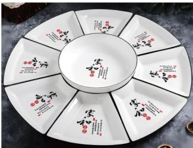
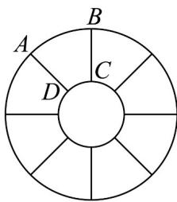
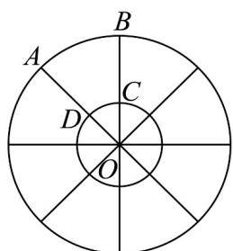
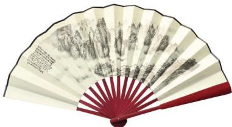
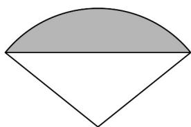

> [!faq]- 《专题11_任意角与弧度制高频题型精准突破_八大题型__高效培优期末专项》官方解析
>
> > [!success]- **【答案】**  图1  图2 A. $45\mathrm{cm}^2$ B. $\frac{45\pi}{2}\mathrm{cm}^2$ C. $\frac{189\pi}{2}\mathrm{cm}^2$ D. $189\mathrm{cm}^2$
>
> > [!note]- **【分析】**
> > 利用扇形面积公式即可求得每个扇环形小拼盘的面积·
>
> > [!note]- **【解析】**
> > 如图，
> >
> > 
> >
> > 设小圆的圆心为 O，则 OC = OD = 12cm，设 $OA = OB = R$ ，每个扇环形小拼盘对应的圆心角为 $\alpha = \frac{2\pi}{8} = \frac{\pi}{4}$ 则 $\square_{AB}$ 的长为 $\alpha R = \frac{15\pi}{2}\mathrm{cm}$ ，解得 $R = 30\mathrm{cm}$ 所以每个扇环形小拼盘的面积为 $S_{\text{扇形} O A B} - S_{\text{扇形} O C D} = \frac{1}{2}\times \frac{\pi}{4}\times 30^{2} - \frac{1}{2}\times \frac{\pi}{4}\times 12^{2} = \frac{189\pi}{2}\left(\mathrm{cm}^{2}\right).$
> >
> > 故选：C
> >
> > 64. 中国传统扇文化有着极其深厚的底蕴，一般情况下，折扇可看作是从一个圆面中剪下的扇形制作而成；一个半径为 $R$ 的扇形，它的周长是 $4R$ ，则这个扇形所含弓形的面积是（）
> >
> > 【答案】
> >
> > 
> >
> > 
> >
> > A. $\frac{1}{2} R^2$ B. $\frac{1}{2} R^2\sin 1\cos 1$ C. $R^2 (1 - \sin 1\cos 1)$ D. $R^2 (2 - \sin 1\cos 1)$
> >
> > 【答案】C
> >
> > 【分析】通过扇形的周长，求出扇形的弧长，求出扇形的圆心角，然后求出扇形的面积，三角形的面积，即可得到这个扇形所含弓形的面积·
> >
> > 【详解】 $l=4R-2R=2R,\alpha=\frac{l}{R}=\frac{2R}{R}=2,$
> >
> > 可得：扇形面积 $S_{1} = \frac{1}{2} lR = \frac{1}{2}\times 2R\times R = R^{2}$
> >
> > 三角形面积 $S_{2} = \frac{1}{2}\times 2R\sin 1\times R\cos 1 = \sin 1\cdot \cos 1\cdot R^{2}$
> >
> > 可得弓形面积 $S = S_{1} - S_{2} = R^{2} - \sin 1\cdot \cos 1\cdot R^{2} = (1 - \sin 1\cos 1)R^{2}$
> >
> > 故选 **C**
