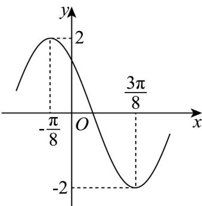

<!-- question-source:start -->
18. 已知函数 $f(x) = A \sin (\omega x + \varphi)$ （ $A > 0, \omega > 0, |\varphi| < \pi$ ）的部分图象如图所示。

(1)求函数 $f(x)$ 的解析式；

(2)将函数 $f(x)$ 的图象向右平移 $\frac{5\pi}{24}$ 个单位长度，再将所得图象上所有点的横坐标变为原来的 $^{2}$ 倍，纵坐标不变，得到函数 $g(x)$ 的图象，求函数 $g(x)$ 在区间 $[0,\pi]$ 内的值域。
<!-- question-source:end -->

![[高中/课堂同步/题库/人教A版高中数学同步讲义(2026)/01_必修第一册/期末/专项训练/专题13_三角函数图像性质与诱导公式高频题型精准突破_八大题型__高效/_compact/answers/Q00067304A1.md]]
