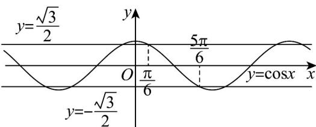

> [!faq]- 《专题13_三角函数图像性质与诱导公式高频题型精准突破_八大题型__高效》官方解析
>
> > [!success]- **【答案】** $\left[2k\pi -\frac{\pi}{4},2k\pi +\frac{3\pi}{4}\right](k\in Z)$
>
> > [!note]- **【分析】**
> > 分 $\sin x$ $\cos x$ 和 $\sin x < \cos x$ 讨论化简 $f(x)$ ，解三角不等式得解
>
> > [!note]- **【解析】**
> > 当 $\sin x\quad \cos x$ ，即 $\frac{\pi}{4} +2k\pi \leq x\leq \frac{5\pi}{4} +2k\pi$ ， $k\in \mathbb{Z}$ 时，
> >
> > $$
> > f (x) = \frac {\sin x + \cos x + \sin x - \cos x}{2} = \sin x
> > $$
> >
> > 所以 $f(x) = \frac{\sqrt{2}}{2}$ ，即 $\sin x = \frac{\sqrt{2}}{2}$ ，解得 $\frac{\pi}{4} + 2k\pi \leq x \leq \frac{3\pi}{4} + 2k\pi$ ， $k \in \mathbb{Z}$ ，
> >
> > 当 $\sin x < \cos x$ ，即 $-\frac{3\pi}{4} + 2k\pi \leq x \leq \frac{\pi}{4} + 2k\pi$ ， $k \in \mathbb{Z}$ 时，
> >
> > $$
> > f (x) = \frac {\sin x + \cos x - \sin x + \cos x}{2} = \cos x
> > $$
> >
> > 所以 $f(x)$ $\frac{\sqrt{2}}{2}$ ，即 $\cos x$ $\frac{\sqrt{2}}{2}$ ，解得 $-\frac{\pi}{4} + 2k\pi \leq x \leq \frac{\pi}{4} + 2k\pi$ ， $k \in \mathbb{Z}$ ，
> >
> > 综上， $f(x)$ $\frac{\sqrt{2}}{2}$ 的解集为 $\left[-\frac{\pi}{4} + 2k\pi, \frac{3\pi}{4} + 2k\pi\right](k \in \mathbb{Z})$
> >
> > 故答案为： $\left[-\frac{\pi}{4} + 2k\pi, \frac{3\pi}{4} + 2k\pi\right](k \in \mathbb{Z})$
> >
> > 36. 不等式 $4\cos^2 x - 3 \leq 0$ 的解集是（）A. $\left[k\pi + \frac{\pi}{6}, k\pi + \frac{5\pi}{6}\right](k \in \mathbf{Z})$ B. $\left[k\pi - \frac{\pi}{6}, k\pi + \frac{\pi}{6}\right](k \in \mathbf{Z})$ C. $\left[k\pi - \frac{\pi}{3}, k\pi + \frac{\pi}{3}\right](k \in \mathbf{Z})$ D. $\left[k\pi + \frac{\pi}{3}, k\pi + \frac{2\pi}{3}\right](k \in \mathbf{Z})$
> >
> > 【答案】A
> >
> > 【分析】解得 $-\frac{\sqrt{3}}{2} \leq \cos x \leq \frac{\sqrt{3}}{2}$ ，再结合余弦函数图像即可求解；
> >
> > 【详解】由 $4\cos^2 x - 3 \leq 0$
> >
> > 可得： $\cos^2 x\leq \frac{3}{4}$
> >
> > 可得 $-\frac{\sqrt{3}}{2} \leq \cos x \leq \frac{\sqrt{3}}{2}$ ，求解 $[0, \pi]$ 上的解集可得： $\left[\frac{\pi}{6}, \frac{5\pi}{6}\right]$
> >
> > 
> >
> > 由图象可知在 $\mathbb{R}$ 上的解集为 $\left[k\pi +\frac{\pi}{6},k\pi +\frac{5\pi}{6}\right]\left(k\in \mathbf{Z}\right)$
> >
> > 故选 **A**
