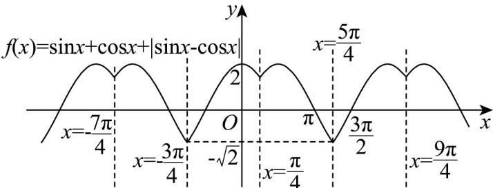

> [!faq]- 《专题13_三角函数图像性质与诱导公式高频题型精准突破_八大题型__高效》官方解析
>
> > [!success]- **【答案】** ABD
>
> > [!note]- **【分析】**
> > 根据函数周期性的定义可判断 $A$ ；分段化简得出函数 $f(x)$ 的解析式，作出其图象，数形结合，可判断 $B, C, D$ .
>
> > [!note]- **【解析】**
> > 对于 A， $f(x+2\pi)=\sin(x+2\pi)+\cos(x+2\pi)+\left|\sin(x+2\pi)-\cos(x+2\pi)\right|$
> >
> > $$
> > = \sin x + \cos x + | \sin x - \cos x |
> > $$
> >
> > 故 $f(x)$ 是以 $2\pi$ 为周期的函数， $^{A}$ 正确；
> >
> > 由于 $f(x) = \left\{ \begin{array}{ll}2\sin x, & 2k\pi + \frac{\pi}{4} \leq x \leq 2k\pi + \frac{5\pi}{4}\\ 2\cos x, & 2k\pi + \frac{5\pi}{4} \leq x \leq 2k\pi + \frac{9\pi}{4} \end{array} , k \in Z \right.$
> >
> > 作出函数 $f(x)$ 的图象如图：
> >
> > 
> >
> > 结合图象可知当且仅当 $x = 2k\pi + \frac{5\pi}{4}$ ， $k \in \mathbb{Z}$ 时，函数取得最小值 $-\sqrt{2}$ ， ${}^{\mathrm{B}}$ 正确；
> >
> > $f(x)$ 图象的对称轴为直线 $x=\frac{\pi}{4}+k\pi$ ， $k\in Z$ ，C 错误；
> >
> > 当且仅当 $2k\pi + \pi < x < 2k\pi + \frac{3\pi}{2}$ ， $k \in \mathbb{Z}$ 时， $-\sqrt{2} \leq f(x) < 0$ ， $^{\mathrm{D}}$ 正确，
> >
> > 故选 **ABD**
