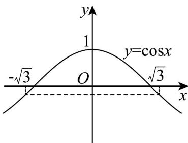

> [!faq]- 《专题13_三角函数图像性质与诱导公式高频题型精准突破_八大题型__高效》官方解析
>
> > [!success]- **【答案】** (1) $\left(-\infty,-\frac{11\sqrt{3}}{24}\right]$ (2) $\left[k\pi - \frac{\pi}{3}, k\pi + \frac{\pi}{3}\right](k \in \mathbf{Z})$
>
> > [!note]- **【分析】**
> > （1）由 $f\left(\frac{\pi}{6}\right) = -1$ 求得 $\varphi = \frac{5\pi}{6}$ ，根据正弦函数性质可得 $f(x)_{\min} = -\frac{5}{4}$ ，然后将问题转化为， $\exists x_2 \in \left[\frac{\pi}{3}, \frac{\pi}{2}\right]$ ，使得 $g(x_2) = 2\sin^2 x_2 + 4t\sin x_2 \leq -\frac{5}{4}$ ，参变分离，结合对勾函数性质可解；
> >
> > (2) 先求 $h(x)$ 的解析式，然后结合余弦函数图象即可求解.
>
> > [!note]- **【解析】**
> > （1）因为 $f(x) = \frac{1}{2}\sin (2x + \varphi) - \frac{3}{4}\left(\frac{\pi}{2} < \varphi < \pi\right)$ ，
> >
> > 则 $f\left(\frac{\pi}{6}\right) = \frac{1}{2}\sin \left(\frac{\pi}{3} +\varphi\right) - \frac{3}{4} = -1$ ，可得 $\sin \left(\varphi +\frac{\pi}{3}\right) = -\frac{1}{2}$
> >
> > 因为 $\frac{\pi}{2} < \varphi < \pi$ ，则 $\frac{5\pi}{6} < \varphi + \frac{\pi}{3} < \frac{4\pi}{3}$ ，所以 $\varphi + \frac{\pi}{3} = \frac{7\pi}{6}$ ，可得 $\varphi = \frac{5\pi}{6}$ 。
> >
> > 所以 $f(x)=\frac{1}{2}\sin\left(2x+\frac{5\pi}{6}\right)-\frac{3}{4}$
> >
> > 当 $0 \leq x \leq \frac{\pi}{2}$ 时， $\frac{5\pi}{6} \leq 2x + \frac{5\pi}{6} \leq \frac{11\pi}{6}$ ，则 $f(x)_{\min} = \frac{1}{2}\sin \frac{3\pi}{2} - \frac{3}{4} = -\frac{5}{4}$ ，
> >
> > 依题意， $\exists x_{2}\in \left[\frac{\pi}{3},\frac{\pi}{2}\right]$ ，使得 $g(x_{2}) = 2\sin^{2}x_{2} + 4t\sin x_{2}\leq -\frac{5}{4}$
> >
> > 所以 $t \leq \frac{-2\sin^2 x_2 - \frac{5}{4}}{4\sin x_2} = -\frac{1}{2}\sin x_2 - \frac{5}{16\sin x_2} = -\frac{1}{2}\left(\sin x_2 + \frac{5}{8\sin x_2}\right)$
> >
> > 因为 $x_{2} \in \left[\frac{\pi}{3}, \frac{\pi}{2}\right]$ ，则 $\frac{\sqrt{3}}{2} \leq \sin x_{2} \leq 1$ ，
> >
> > 令 $p = \sin x_{2}\in \left[\frac{\sqrt{3}}{2},1\right]$ ，函数 $y = -\frac{1}{2}\left(p + \frac{5}{8p}\right)$ 在 $\left[\frac{\sqrt{3}}{2},1\right]$ 上单调递减，
> >
> > 所以 $y_{\max} = -\frac{1}{2}\left(\frac{\sqrt{3}}{2} + \frac{5}{8 \times \frac{\sqrt{3}}{2}}\right) = -\frac{11\sqrt{3}}{24}$ ，所以， $t \leq -\frac{11\sqrt{3}}{24}$ ，
> >
> > 因此，实数 $t$ 的取值范围是 $\left(-\infty, -\frac{11\sqrt{3}}{24}\right]$
> >
> > (2) 因为 $h(x)$ 与 $f(x)$ 的图象关于直线 $x = -\frac{\pi}{12}$ 对称，
> >
> > $$
> > h (x) = f \left(- \frac {\pi}{6} - x\right) = \frac {1}{2} \sin \left[ \frac {5 \pi}{6} + 2 \left(- \frac {\pi}{6} - x\right) \right] - \frac {3}{4}
> > $$
> >
> > $$
> > = \frac {1}{2} \sin \left(\frac {\pi}{2} - 2 x\right) = \frac {1}{2} \cos 2 x - \frac {3}{4}
> > $$
> >
> > 因为 $h(\sin x) - h\left(\frac{\sqrt{3}}{2}\right)$ ，令 $m = \sin x$
> >
> > 则 $h(m) = \frac{1}{2}\cos 2m - \frac{3}{4}$ $h\left(\frac{\sqrt{3}}{2}\right) = \frac{1}{2}\cos \sqrt{3} -\frac{3}{4}$ ，即 $\cos 2m\quad \cos \sqrt{3}$
> >
> > 作出函数 $y = \cos x$ 的图象如图所示：
> >
> > 
> >
> > 由 $\cos 2m$ $\cos \sqrt{3}$ 可得 $2k\pi -\sqrt{3}\leq 2m\leq 2k\pi +\sqrt{3}(k\in \mathbf{Z})$
> >
> > 即 $k\pi - \frac{\sqrt{3}}{2} \leq \sin x \leq k\pi + \frac{\sqrt{3}}{2} (k \in \mathbf{Z})$
> >
> > 因为 $-1 \leq \sin x \leq 1$ ，故 $k = 0$ ，可得 $-\frac{\sqrt{3}}{2} \leq \sin x \leq \frac{\sqrt{3}}{2}$
> >
> > 解得 $2n\pi - \frac{\pi}{3} \leq x \leq 2n\pi + \frac{\pi}{3}(n \in \mathbf{Z})$ 或 $2n\pi + \frac{2\pi}{3} \leq x \leq 2n\pi + \frac{4\pi}{3}(n \in \mathbf{Z})$
> >
> > 即 $k\pi - \frac{\pi}{3} \leq x \leq k\pi + \frac{\pi}{3} (k \in \mathbf{Z})$
> >
> > 因此，原不等式的解集为 $\left[k\pi -\frac{\pi}{3},k\pi +\frac{\pi}{3}\right]\left(k\in \mathbf{Z}\right)$
