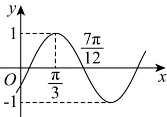

> [!faq]- 《专题15_三角函数图像变换高频题型精准突破_八大题型__高效培优期末专》官方解析
>
> > [!success]- **【答案】**  A. 向左平移 $\frac{\pi}{6}$ 个单位长度 B. 向右平移 $\frac{\pi}{6}$ 个单位长度 C. 向左平移 $\frac{\pi}{12}$ 个单位长度 D. 向右平移 $\frac{\pi}{12}$ 个单位长度
>
> > [!note]- **【分析】**
> > 根据图象求出 $f(x)$ 的解析式，再根据图象的平移法则即可得答案。
>
> > [!note]- **【解析】**
> > 解：由题意可得 $T=4\left(\frac{7\pi}{12}-\frac{\pi}{3}\right)=\pi$ 所以 $\frac{2\pi}{\omega}=\pi,\quad\omega=2$ 又因为 $f(\frac{\pi}{3})=\sin(2\times\frac{\pi}{3}+\varphi)=1$ 所以 $\frac{2\pi}{3}+\varphi=2k\pi+\frac{\pi}{2},k\in Z$ 所以 $\varphi=2k\pi-\frac{\pi}{6},k\in Z$ 又因为 $\left|\varphi\right|<\frac{\pi}{2}$ 所以 k=0, $\varphi=-\frac{\pi}{6}$
> >
> > 所以 $f(x) = \sin \left(2x - \frac{\pi}{6}\right) = \sin 2\left(x - \frac{\pi}{12}\right)$
> >
> > 所以只需将 $f(x)$ 的图象向左平移 $\frac{\pi}{12}$ 个单位，即可得 $y = \sin 2x$ 的解析式
> >
> > 故选 **C**.
